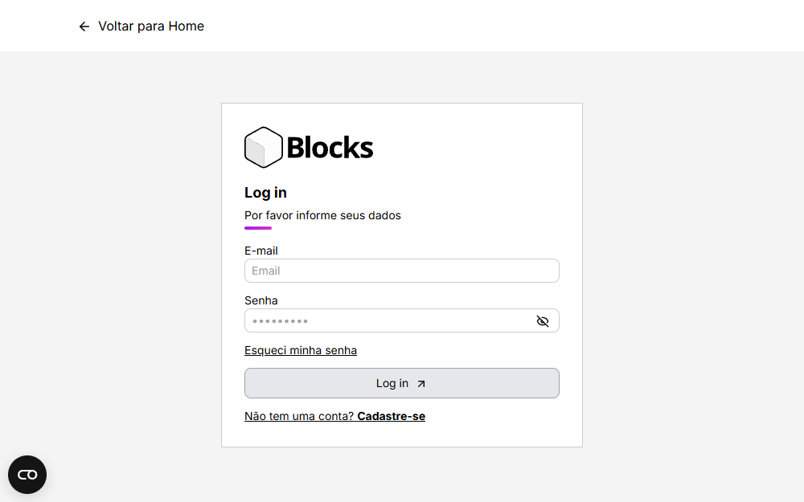
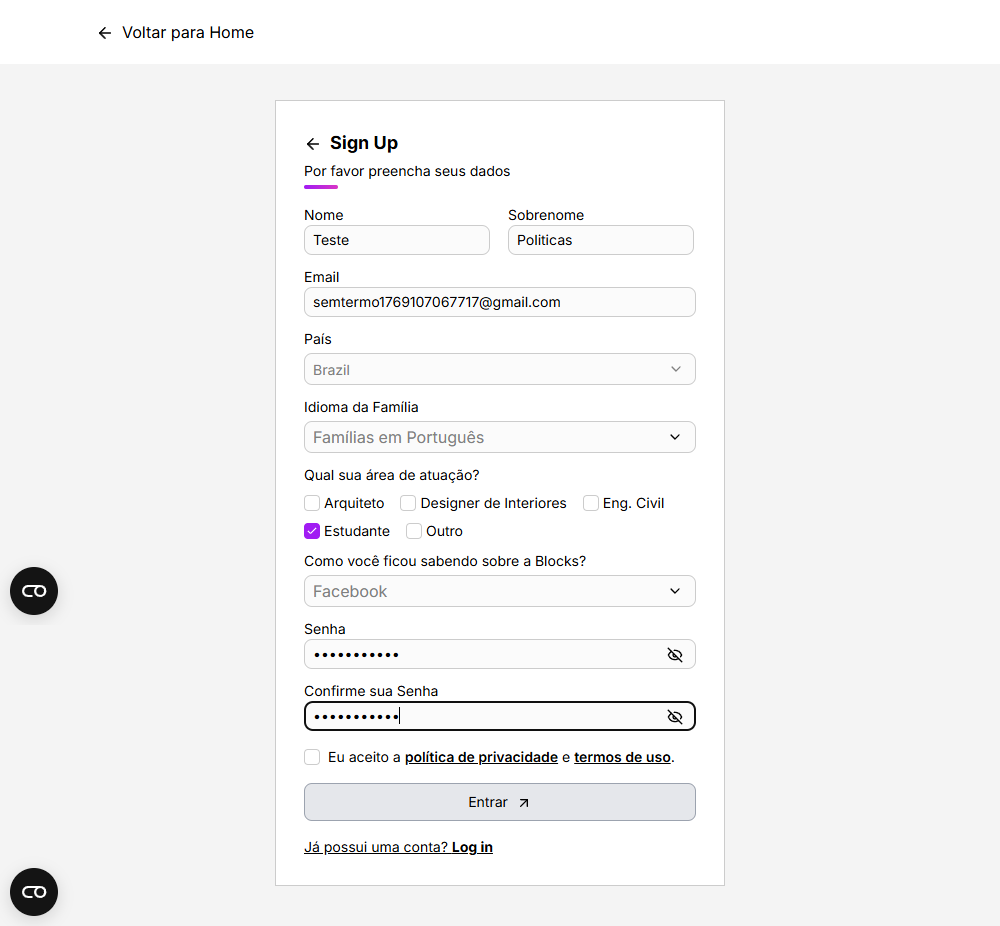

# Relatório de Testes Automatizados - Blocks

## Informações do Projeto

| Campo | Descrição |
|-------|-----------|
| **Projeto** | Blocks - Página de Cadastro de Usuários |
| **URL** | https://www.blocksrvt.com/pt/registrar |
| **Autor** | Cristhian Cintra Barbosa |
| **Ferramenta** | Cypress v15.9.0 |
| **Data** | 22/01/2026 |

---

## 1. Objetivo do Relatório

Este relatório tem como objetivo apresentar e documentar os resultados dos testes automatizados realizados no fluxo de cadastro de usuários da plataforma Blocks, bem como registrar análises de qualidade, riscos e pontos de melhoria identificados durante a execução dos testes.

---

## 2. Escopo dos Testes

Os testes foram executados exclusivamente no fluxo de cadastro via interface web, não contemplando testes de performance, segurança, acessibilidade ou integração com APIs externas.

Os testes cobriram os seguintes aspectos:

- Fluxo de cadastro de usuários
- Validação de formulário
- Cenários positivos e negativos
- Mensagens de erro
- Comportamento do botão de submissão

---

## 3. Estratégia de Testes

A estratégia adotada foi de **testes E2E (End-to-End) automatizados**, simulando o comportamento real do usuário final.

### Principais Abordagens:

- **Testes independentes por cenário** - Cada teste executa de forma isolada
- **Uso de massa de dados via fixtures** - Dados organizados e reutilizáveis
- **Geração dinâmica de dados únicos** - Emails com timestamp para evitar duplicação
- **Validação de comportamento e feedback visual** - Screenshots e assertions

---

## 4. Cenários Executados

| ID | Cenário | Tipo | Resultado |
|----|---------|------|-----------|
| **CT-01** | Cadastro de usuário com sucesso | Positivo | Passou |
| **CT-02** | Cadastro com email inválido | Negativo | Passou |
| **CT-03** | Cadastro com email duplicado | Negativo | Passou |
| **CT-04** | Cadastro sem aceitar política de privacidade | Negativo | Passou |
| **CT-05** | Cadastro com senhas diferentes | Negativo | Passou |

### Cenário de Teste CT-01 - Cadastro de usuário com sucesso

- História do usuário:
    - Como um usuário que deseja acessar a plataforma Blocks, quero realizar meu cadastro preenchendo corretamente as informações obrigatórias. Para que eu possa utilizar as funcionalidades da plataforma.

- Critérios de Aceite Validados:
    - Preenchimento de todos os campos obrigatórios
    - Aceite da política de privacidade
    - Submissão bem-sucedida do formulário
    - Redirecionamento para a página de login

**Resultado:** Passou

Evidências:
- `cypress/screenshots/cadastroCompleto.cy.js/cadastroCompleto.png` e `cypress/screenshots/cadastroCompleto.cy.js/aposCadastro.png`

### Cenário de Teste CT-02 - Cadastro com email inválido

- História do usuário:
    - Como um usuário quero ser informado quando adicionar um email inválido, para que eu possa corrigir o dado e concluir meu cadastro corretamente.

- Critérios de Aceite Validados:
    - Detecção de formato de email inválido
    - Exibição de mensagem de erro de validação
    - Bloqueio da submissão do formulário

**Resultado:** Passou

Evidências:
- `cypress/screenshots/cadastroEmailInv.cy.js/cadastroInvalido.png` e `cypress/screenshots/cadastroEmailInv.cy.js/aposCadastroInvalido.png`

### Cenário de Teste CT-03 - Cadastro com email duplicado

- História do usuário:
    - Como um usuário quero ser informado quando adicionar um email já em uso, para que eu possa corrigir o dado e concluir meu cadastro corretamente.

- Critérios de Aceite Validados:
    - Detecção de email duplicado
    - Exibição de mensagem de erro
    - Bloqueio da submissão do formulário

**Resultado:** Passou

Evidências:
- `cypress/screenshots/cadastroEmailInv.cy.js/emailjaUsado.png` e `cypress/screenshots/cadastroEmailInv.cy.js/aposEmailjaUsado.png`

### Cenário de Teste CT-04 - Cadastro sem aceitar política de privacidade

- História de usuário:
    - Como um usuário quero tentar me cadastrar na plataforma Blocks sem aceitar a política de privacidade, para entender quais ações serão necessárias para concluir meu cadastro.

- Critérios de Aceite Validados:
    - Detecção da ausência de aceite da política de privacidade
    - Bloqueio da submissão do formulário

**Resultado:** Passou

Evidências:
- `cypress/screenshots/cadastroSemTermo.cy.js/cadastroSemTermo.png` e `cypress/screenshots/cadastroSemTermo.cy.js/aposCadastroSemTermo.png`

## Observação de Experiência do Usuário (Sugestão de Melhoria)

Durante a execução do teste, foi observado que ao não aceitar a política de privacidade, o botão de submissão permanece desabilitado, impedindo o cadastro.
No entanto, não há feedback visual ou mensagem informativa indicando ao usuário o motivo do bloqueio.

**Sugestão:** Exibir uma mensagem de orientação (ex: "É necessário aceitar a política de privacidade para continuar") ou um destaque visual no campo correspondente, a fim de melhorar a clareza e a experiência do usuário.

**Classificação:**
- Tipo: Sugestão de Melhoria / UX
- Severidade: Não se aplica
- Impacto: Experiência do usuário

A ausência de feedback visual pode gerar dúvidas ao usuário, principalmente em seu primeiro contato com a plataforma, aumentando o risco de abandono do fluxo.

### Cenário de Teste CT-05 - Cadastro com senhas diferentes

- História do usuário:
    - Como um usuário quero ser informado quando adicionar senhas diferentes, para que eu possa corrigir a informação e concluir meu cadastro corretamente.

- Critérios de Aceite Validados:
    - Detecção de senhas diferentes
    - Exibição de mensagem de erro de validação
    - Bloqueio da submissão do formulário

**Resultado:** Passou

Evidências:
- `cypress/screenshots/cadastroSenhaDif.cy.js/cadastroSenhaDif.png` e `cypress/screenshots/cadastroSenhaDif.cy.js/aposCadastroSenhaDif.png`

---

## 5. Resultados Gerais da Execução

```
Resumo da Execução
━━━━━━━━━━━━━━━━━━━━━━━━━━━━━━━━━━━━━━━━
Total de Testes:     5
Testes Aprovados:    5
Testes Reprovados:   0
Taxa de Sucesso:     100%
Tempo Total:         ~36 segundos
━━━━━━━━━━━━━━━━━━━━━━━━━━━━━━━━━━━━━━━━
```

---

## 6. Bugs Identificados

### Bug #01 - Internacionalização (Email Inválido)

| Campo | Detalhes |
|-------|----------|
| **Descrição** | Mensagem de validação de email inválido aparece em inglês ("This is not a valid email.") mesmo quando a página está configurada em português |
| **Ambiente** | Página localizada em português (`/pt/registrar`) e espanhol (`/es/registrar`) |
| **Localização** | Campo de email do formulário de cadastro |
| **Comportamento Atual** | Mensagem exibida: "This is not a valid email." |
| **Comportamento Esperado** | Mensagem em português: "Este não é um e-mail válido." |
| **Severidade** | Baixa |
| **Impacto** | Experiência do usuário - Inconsistência de idioma |
| **Status** | Identificado |
| **Evidência** | `cypress/screenshots/cadastroEmailInv.cy.js/cadastroInvalido.png` |

### Bug #02 - Internacionalização (Senhas Diferentes)

| Campo | Detalhes |
|-------|----------|
| **Descrição** | Mensagem de validação de senhas diferentes aparece em inglês ("Passwords must match") mesmo quando a página está configurada em português |
| **Ambiente** | Página localizada em português (`/pt/registrar`) e espanhol (`/es/registrar`) |
| **Localização** | Campo de confirmação de senha do formulário de cadastro |
| **Comportamento Atual** | Mensagem exibida: "Passwords must match" |
| **Comportamento Esperado** | Mensagem em português: "As senhas devem coincidir" |
| **Severidade** | Baixa |
| **Impacto** | Experiência do usuário - Inconsistência de idioma |
| **Status** | Identificado |
| **Evidência** | `cypress/screenshots/cadastroSenhaDif.cy.js/cadastroSenhaDif.png` |

---

## 7. Análise Crítica de Qualidade

### Pontos Positivos:

- Fluxo de cadastro funciona corretamente do ponto de vista funcional
- Validações de campos estão implementadas
- Feedback visual adequado (botão desabilitado, mensagens de erro)
- Redirecionamento após cadastro bem-sucedido funciona conforme esperado

### Pontos de Atenção:

- Inconsistências de internacionalização nas mensagens de validação
- Impacto na percepção de qualidade do produto
- Possível confusão para usuários não familiarizados com inglês

### Observações Técnicas:

Os testes automatizados foram implementados de forma a validar o comportamento atual da aplicação, evitando falhas artificiais causadas por textos fixos. Isso garante que os testes reflitam a realidade do sistema e não quebrem desnecessariamente.

---

## 8. Recomendações

### Curto Prazo:

1. **Padronizar mensagens de validação** conforme o idioma selecionado na página
2. **Revisar todas as mensagens do formulário** para garantir consistência de idioma
3. **Implementar testes de regressão** para validações de idioma

### Médio Prazo:

4. **Incluir critérios de aceite relacionados a idioma** nos requisitos de funcionalidade
5. **Criar checklist de internacionalização** para novas features
6. **Documentar padrões de mensagens** por idioma suportado

### Longo Prazo:

7. **Implementar testes de internacionalização automatizados** no pipeline CI/CD
8. **Criar biblioteca centralizada de mensagens** por idioma
9. **Realizar auditoria completa de internacionalização** em toda a aplicação

---

## 9. Considerações Finais

O fluxo principal de cadastro encontra-se funcional e estável, atendendo aos requisitos funcionais esperados. Todos os cenários de teste foram executados com sucesso, demonstrando a robustez do sistema.

Os bugs identificados são de severidade baixa e não impedem o uso da funcionalidade, mas impactam a experiência do usuário.

Os testes automatizados implementados cumprem o objetivo proposto no desafio e evidenciam boas práticas de automação e análise de qualidade, incluindo:

- Padrão AAA (Arrange, Act, Assert)
- Data-Driven Testing
- Geração dinâmica de dados
- Evidências visuais (screenshots)
- Relatórios detalhados

De forma geral, a aplicação demonstra estabilidade funcional no fluxo de cadastro, com oportunidades de melhoria em aspectos de experiência de usuário e internacionalização, que poderia elevar ainda mais a percepção de qualidade do produto.

---

## Apêndice - Evidências Visuais (Screenshots)

### CT-01 - Cadastro com sucesso



**Descrição:** Prova visual do redirecionamento para página de login após cadastro bem-sucedido

### CT-02 - Cadastro com email inválido


**Descrição:** Prova visual do alerta de email inválido

### CT-03 - Cadastro com email já em uso


**Descrição:** Prova visual do alerta de email já em uso

### CT-04 - Cadastro sem aceitar política de privacidade



**Descrição:** Prova visual da tentativa de cadastro sem aceitar a política de privacidade

### CT-05 - Cadastro com senhas diferentes


**Descrição:** Prova visual da tentativa de cadastro com senhas diferentes

--- 

**Relatório gerado por:** Cristhian Cintra Barbosa  
**Ferramenta de automação:** Cypress v15.9.0  
**Data:** 22/01/2026
