# Relatório de Testes Automatizados - Blocks

## Informações do Projeto

| Campo | Descrição |
|-------|-----------|
| **Projeto** | Blocks - Página de Cadastro de Usuários |
| **URL** | https://www.blocksrvt.com/pt/registrar |
| **Autor** | Cristhian Cintra Barbosa |
| **Ferramenta** | Cypress v15.9.0 |
| **Data** | 22/01/2026 |
| **Última reexecução** | 27/09/2026 |
| **Repositório** | [https://github.com/CintraB/qa-blocks](https://github.com/CintraB/qa-blocks) |

---

## Resumo Executivo

Além da entrega original (22/01/2026), o projeto foi ampliado em 26 e 27/09/2026 com três frentes principais.

**1. Achado crítico de privacidade (Bug #05, severidade alta, LGPD)**

A API que o formulário consulta para verificar se um email já está cadastrado (`GET https://api.blocksrvt.com/v1/user/email/<email>`) responde **sem autenticação** com dados pessoais do titular da conta: endereço IP, geolocalização (cidade, CEP, latitude e longitude), provedor de internet, datas de cadastro e de aceite dos termos e dados do perfil. A resposta também diferencia email cadastrado (`HTTP 200`) de não cadastrado (`HTTP 404`), o que permite descobrir quem tem conta na Blocks. Uma verificação com uma conta que não foi criada pelos testes confirmou que os dados são **do titular**, e não de quem faz a consulta, e um dos campos (`partnerCode`) apresentou formato de CPF. O achado está embasado nos Arts. 5º, 6º (necessidade, segurança e prevenção) e 46 da LGPD, com prints das fontes oficiais, e é a **prioridade imediata** das recomendações. Nenhum dado pessoal de terceiros foi registrado ou exibido neste relatório.

**2. Integração contínua (CI) no GitHub Actions**

A suíte roda automaticamente no GitHub Actions a cada push na `main`, em pull requests e sob demanda ([workflow `e2e.yml`](https://github.com/CintraB/qa-blocks/actions/workflows/e2e.yml)), em três etapas independentes:

| Etapa | O que roda | Efeito no resultado |
|-------|------------|---------------------|
| Suíte principal (`npm test`) | 47 testes de cadastro, validações, responsividade e feedback | Define o status do workflow e o selo do README; cada teste tem 1 nova tentativa no CI para absorver instabilidade de rede |
| Testes de idioma (`npm run test:idiomas`) | Textos da página em português, espanhol e inglês | Falham de propósito (bugs registrados), sem quebrar o workflow |
| Bugs conhecidos (`npm run test:bugs`) | Regressão dos Bugs #07, #08 e #09 | Falham de propósito até a correção, sem quebrar o workflow |

O relatório HTML e os screenshots de cada execução ficam disponíveis como artefatos por 14 dias. Não há execução agendada, porque cada execução cria contas reais no ambiente da Blocks. O projeto não tem etapa de implantação (CD), pois não publica nenhum software: a entrega de cada execução são os relatórios.

**3. Testes de UI/UX**

- **Responsividade (CT-11):** 4 aparelhos emulados como no modo de dispositivo do DevTools (iPhone SE, iPhone 14, Galaxy S20 e iPad, com toque e user agent do aparelho) e 4 larguras de desktop, incluindo o equivalente a zoom de 200% e 400%. Todos passaram.
- **Feedback do formulário (CT-12):** mostrar/ocultar senha, momento das mensagens de erro e campos obrigatórios em branco, com base nas diretrizes da Nielsen Norman Group. Observações: o erro do email aparece já na primeira tecla digitada, e campos obrigatórios em branco não exibem mensagem.
- **Duplo clique no botão de cadastro (Bug #09, severidade média):** o cadastro é enviado duas vezes; uma requisição cria a conta e a outra recebe erro 500, e a tela fica com dois avisos "Carregando..." que não somem. Reproduzido em 6 de 6 execuções.

**Resultado atual:** suíte principal com 47 de 47 testes aprovados e 9 bugs registrados (1 de severidade alta, 3 médios e 5 baixos), com evidências e fontes em cada apontamento.

---

## 1. Objetivo do Relatório

Este relatório tem como objetivo apresentar e documentar os resultados dos testes automatizados realizados no fluxo de cadastro de usuários da plataforma Blocks, bem como registrar análises de qualidade, riscos e pontos de melhoria identificados durante a execução dos testes.

---

## 2. Escopo dos Testes

Os testes foram executados exclusivamente no fluxo de cadastro via interface web, não contemplando testes de performance, segurança, acessibilidade ou integração com APIs externas.

> Na reexecução de 26/09/2026, um problema de segurança/privacidade foi identificado de forma **incidental**, ao observar a requisição que o próprio formulário faz para validar o email (ver Bug #05). Não foram realizados testes de segurança além dessa observação.

Os testes cobriram os seguintes aspectos:

- Fluxo de cadastro de usuários
- Validação de formulário
- Cenários positivos e negativos
- Mensagens de erro
- Comportamento do botão de submissão
- Responsividade em celular, tablet e desktop (ampliação de 27/09/2026)
- Feedback do formulário: mostrar/ocultar senha, momento das mensagens e envio repetido (ampliação de 27/09/2026)

---

## 3. Estratégia de Testes

A estratégia adotada foi de **testes E2E (End-to-End) automatizados**, simulando o comportamento real do usuário final.

### Principais Abordagens:

- **Testes independentes por cenário** - Cada teste executa de forma isolada
- **Uso de massa de dados via fixtures** - Dados organizados e reutilizáveis
- **Geração dinâmica de dados únicos** - Emails com timestamp para evitar duplicação
- **Validação de comportamento e feedback visual** - Screenshots e assertions

---

## 4. Cenários Executados

| ID | Cenário | Tipo | Resultado |
|----|---------|------|-----------|
| **CT-01** | Cadastro de usuário com sucesso e login com a conta criada | Positivo | Passou |
| **CT-02** | Cadastro com email inválido | Negativo | Passou |
| **CT-03** | Cadastro com email duplicado | Negativo | Passou |
| **CT-04** | Cadastro sem aceitar política de privacidade | Negativo | Passou |
| **CT-05** | Cadastro com senhas diferentes | Negativo | Passou |
| **CT-06** | Cadastro com email duplicado escrito em letras maiúsculas | Negativo | Passou |
| **CT-07** | Regras de senha: valor-limite e partição de equivalência (9 casos) | Positivo/Negativo | Passou (9/9) |
| **CT-08** | Campos obrigatórios, um de cada vez (10 casos) | Negativo | Passou (10/10) |
| **CT-09** | Senha no servidor: limite de 256 caracteres, login e senha truncada em 72 | Positivo/Negativo | Passou |
| **CT-10** | Variações de nome, país, área de atuação e email (10 casos) | Positivo/Negativo | Passou (10/10) |
| **CT-11** | Responsividade: 4 aparelhos emulados e 4 larguras de desktop, incluindo zoom de 200% e 400% (8 casos) | Positivo | Passou (8/8) |
| **CT-12** | Feedback do formulário: mostrar/ocultar senha, momento da validação e campos em branco (3 casos) | Positivo | Passou (3/3) |

> CT-01 a CT-05 são os cenários da entrega original (22/01/2026). O login no CT-01 e os cenários CT-06 a CT-12 foram adicionados em 27/09/2026. O envio do cadastro com duplo clique fica na suíte de bugs conhecidos (Bug #09).

### Cenário de Teste CT-01 - Cadastro de usuário com sucesso

- História do usuário:
    - Como um usuário que deseja acessar a plataforma Blocks, quero realizar meu cadastro preenchendo corretamente as informações obrigatórias. Para que eu possa utilizar as funcionalidades da plataforma.

- Critérios de Aceite Validados:
    - Preenchimento de todos os campos obrigatórios
    - Aceite da política de privacidade
    - Submissão bem-sucedida do formulário
    - Redirecionamento para a página de login
    - **(27/09/2026)** Login com o email e a senha recém-cadastrados: redirecionamento para `/pt/home` e sessão ativa (cookie `is_logged`), provando que o cadastro foi de fato gravado

**Resultado:** Passou

Evidências:
- [evidencias/cypress/cadastroCompleto.cy.js/cadastroCompleto.png](evidencias/cypress/cadastroCompleto.cy.js/cadastroCompleto.png), [evidencias/cypress/cadastroCompleto.cy.js/aposCadastro.png](evidencias/cypress/cadastroCompleto.cy.js/aposCadastro.png) e [evidencias/cypress/cadastroCompleto.cy.js/aposLogin.png](evidencias/cypress/cadastroCompleto.cy.js/aposLogin.png)

> O aviso "Login efetuado com sucesso!" não é validado pelo teste: no primeiro login ele vem acompanhado de "Algo deu errado. Por favor, tente novamente." e nem sempre aparece a tempo (Bug #07).

### Cenário de Teste CT-02 - Cadastro com email inválido

- História do usuário:
    - Como um usuário quero ser informado quando adicionar um email inválido, para que eu possa corrigir o dado e concluir meu cadastro corretamente.

- Critérios de Aceite Validados:
    - Detecção de formato de email inválido
    - Exibição de mensagem de erro de validação
    - Bloqueio da submissão do formulário

**Resultado:** Passou

Evidências:
- [evidencias/cypress/cadastroEmailInv.cy.js/cadastroInvalido.png](evidencias/cypress/cadastroEmailInv.cy.js/cadastroInvalido.png) e [evidencias/cypress/cadastroEmailInv.cy.js/aposcadastroInvalido.png](evidencias/cypress/cadastroEmailInv.cy.js/aposcadastroInvalido.png)

### Cenário de Teste CT-03 - Cadastro com email duplicado

- História do usuário:
    - Como um usuário quero ser informado quando adicionar um email já em uso, para que eu possa corrigir o dado e concluir meu cadastro corretamente.

- Critérios de Aceite Validados:
    - Detecção de email duplicado
    - Exibição de mensagem de erro
    - Bloqueio da submissão do formulário

**Resultado:** Passou

Evidências:
- [evidencias/cypress/cadastroEmailInv.cy.js/emailjaUsado.png](evidencias/cypress/cadastroEmailInv.cy.js/emailjaUsado.png) e [evidencias/cypress/cadastroEmailInv.cy.js/aposEmailjaUsado.png](evidencias/cypress/cadastroEmailInv.cy.js/aposEmailjaUsado.png)

### Cenário de Teste CT-04 - Cadastro sem aceitar política de privacidade

- História de usuário:
    - Como um usuário quero tentar me cadastrar na plataforma Blocks sem aceitar a política de privacidade, para entender quais ações serão necessárias para concluir meu cadastro.

- Critérios de Aceite Validados:
    - Detecção da ausência de aceite da política de privacidade
    - Bloqueio da submissão do formulário

**Resultado:** Passou

Evidências:
- [evidencias/cypress/cadastroSemTermo.cy.js/cadastroSemTermo.png](evidencias/cypress/cadastroSemTermo.cy.js/cadastroSemTermo.png) e [evidencias/cypress/cadastroSemTermo.cy.js/aposCadastroSemTermo.png](evidencias/cypress/cadastroSemTermo.cy.js/aposCadastroSemTermo.png)

## Observação de Experiência do Usuário (Sugestão de Melhoria)

Durante a execução do teste, foi observado que ao não aceitar a política de privacidade, o botão de submissão permanece desabilitado, impedindo o cadastro.
No entanto, não há feedback visual ou mensagem informativa indicando ao usuário o motivo do bloqueio.

**Sugestão:** Exibir uma mensagem de orientação (ex: "É necessário aceitar a política de privacidade para continuar") ou um destaque visual no campo correspondente, a fim de melhorar a clareza e a experiência do usuário.

**Classificação:**
- Tipo: Sugestão de Melhoria / UX
- Severidade: Não se aplica
- Impacto: Experiência do usuário

A ausência de feedback visual pode gerar dúvidas ao usuário, principalmente em seu primeiro contato com a plataforma, aumentando o risco de abandono do fluxo.

### Cenário de Teste CT-05 - Cadastro com senhas diferentes

- História do usuário:
    - Como um usuário quero ser informado quando adicionar senhas diferentes, para que eu possa corrigir a informação e concluir meu cadastro corretamente.

- Critérios de Aceite Validados:
    - Detecção de senhas diferentes
    - Exibição de mensagem de erro de validação
    - Bloqueio da submissão do formulário

**Resultado:** Passou

Evidências:
- [evidencias/cypress/cadastroSenhaDif.cy.js/cadastroSenhaDif.png](evidencias/cypress/cadastroSenhaDif.cy.js/cadastroSenhaDif.png) e [evidencias/cypress/cadastroSenhaDif.cy.js/aposCadastroSenhaDif.png](evidencias/cypress/cadastroSenhaDif.cy.js/aposCadastroSenhaDif.png)

### Cenário de Teste CT-06 - Cadastro com email duplicado escrito em letras maiúsculas

- História do usuário:
    - Como plataforma, não quero permitir duas contas para o mesmo email escrito com outra combinação de maiúsculas e minúsculas, para evitar contas duplicadas do mesmo usuário.

- Critérios de Aceite Validados:
    - O teste cadastra uma conta com email em minúsculas e, como visitante novo, digita o mesmo email em MAIÚSCULAS
    - Exibição de "Este email já está em uso."
    - Bloqueio da submissão do formulário

**Resultado:** Passou. A verificação de email é insensível a maiúsculas/minúsculas (comportamento correto).

Evidência:
- [evidencias/cypress/cadastroEmailInv.cy.js/emailjaUsadoMaiusculas.png](evidencias/cypress/cadastroEmailInv.cy.js/emailjaUsadoMaiusculas.png)

### Cenário de Teste CT-07 - Regras de senha (valor-limite e partição de equivalência)

- Regras observadas no formulário (27/09/2026): **mínimo de 9 caracteres**, com pelo menos **uma letra maiúscula, uma minúscula, um número e um caractere especial**.
- Técnicas: **análise de valor-limite** (8, 9 e 10 caracteres) e **partição de equivalência** (uma classe inválida por regra).
- Para não quebrar quando as mensagens (hoje em inglês) forem traduzidas, cada regra é reconhecida por uma expressão que aceita inglês e português. Nos casos válidos, o teste primeiro digita uma senha inválida e confirma o erro, e só então digita a válida e confirma que o erro some, garantindo que a validação estava ativa.

| Caso | Senha | Esperado | Mensagem exibida hoje | Resultado |
|------|-------|----------|-----------------------|-----------|
| 8 caracteres (limite mínimo - 1) | `Ab1*Ab1*` | Rejeitar | "Password must be at least 9 characters long" | Passou |
| Sem letra maiúscula | `abcdefg1*` | Rejeitar | "Password must contain at least one uppercase letter" | Passou |
| Sem letra minúscula | `ABCDEFG1*` | Rejeitar | "Password must contain at least one lowercase letter" | Passou |
| Sem número | `Abcdefgh*` | Rejeitar | "Password must contain at least one number" | Passou |
| Sem caractere especial | `Abcdefgh1` | Rejeitar | "Password must contain at least one special character" | Passou |
| 9 caracteres (limite mínimo) | `Ab1*Ab1*a` | Aceitar | - | Passou |
| 10 caracteres (limite mínimo + 1) | `Ab1*Ab1*ab` | Aceitar | - | Passou |
| Com espaço | `Senha 123*a` | Aceitar | - | Passou |
| 160 caracteres | `Aa1*` x 40 | Aceitar (não há limite máximo no formulário) | - | Passou |

**Observações (sem classificação como bug):**
- As mensagens das regras de senha estão em inglês, assim como a de senhas diferentes (Bug #02).
- As regras só são exibidas depois do erro e **uma de cada vez**: o usuário corrige uma e aparece a próxima, sem ver a lista completa antes de digitar.
- O caractere `_` (underscore) **não** é aceito como caractere especial, assim como letras acentuadas e emoji; `!`, `#` e `*` são aceitos.

Evidências (um print por regra violada):

- Sem caractere especial: [evidencias/cypress/cadastroSenha.cy.js/senha-sem-especial.png](evidencias/cypress/cadastroSenha.cy.js/senha-sem-especial.png)
- Sem maiúscula: [evidencias/cypress/cadastroSenha.cy.js/senha-sem-maiuscula.png](evidencias/cypress/cadastroSenha.cy.js/senha-sem-maiuscula.png)
- Sem minúscula: [evidencias/cypress/cadastroSenha.cy.js/senha-sem-minuscula.png](evidencias/cypress/cadastroSenha.cy.js/senha-sem-minuscula.png)
- Sem número: [evidencias/cypress/cadastroSenha.cy.js/senha-sem-numero.png](evidencias/cypress/cadastroSenha.cy.js/senha-sem-numero.png)
- 8 caracteres: [evidencias/cypress/cadastroSenha.cy.js/senha-tamanho-8.png](evidencias/cypress/cadastroSenha.cy.js/senha-tamanho-8.png)

### Cenário de Teste CT-08 - Campos obrigatórios, um de cada vez

- História do usuário:
    - Como plataforma, quero impedir o cadastro enquanto qualquer informação obrigatória estiver faltando.

- Critérios de Aceite Validados (para cada um dos 10 itens: Nome, Sobrenome, Email, País, Idioma da Família, Área de atuação, Como ficou sabendo, Senha, Confirmação de senha e Aceite da política):
    - Com todos os outros campos preenchidos e somente este faltando, o botão de cadastro fica **desabilitado**
    - Ao preencher somente o campo que faltava, o botão **habilita**, provando que ele era o único motivo do bloqueio (evita que o teste passe por engano)
    - Nenhum cadastro é enviado, portanto nenhuma conta é criada

**Resultado:** Passou (10/10). Todos os itens são obrigatórios.

Evidências (um print por campo faltando):

- Sem Área de atuação: [evidencias/cypress/cadastroObrigatorios.cy.js/obrigatorio-sem-areaAtuacao.png](evidencias/cypress/cadastroObrigatorios.cy.js/obrigatorio-sem-areaAtuacao.png)
- Sem Como ficou sabendo: [evidencias/cypress/cadastroObrigatorios.cy.js/obrigatorio-sem-comoSoube.png](evidencias/cypress/cadastroObrigatorios.cy.js/obrigatorio-sem-comoSoube.png)
- Sem Confirmação de senha: [evidencias/cypress/cadastroObrigatorios.cy.js/obrigatorio-sem-confirmarSenha.png](evidencias/cypress/cadastroObrigatorios.cy.js/obrigatorio-sem-confirmarSenha.png)
- Sem Email: [evidencias/cypress/cadastroObrigatorios.cy.js/obrigatorio-sem-email.png](evidencias/cypress/cadastroObrigatorios.cy.js/obrigatorio-sem-email.png)
- Sem Idioma da Família: [evidencias/cypress/cadastroObrigatorios.cy.js/obrigatorio-sem-idiomaFamilia.png](evidencias/cypress/cadastroObrigatorios.cy.js/obrigatorio-sem-idiomaFamilia.png)
- Sem Nome: [evidencias/cypress/cadastroObrigatorios.cy.js/obrigatorio-sem-nome.png](evidencias/cypress/cadastroObrigatorios.cy.js/obrigatorio-sem-nome.png)
- Sem País: [evidencias/cypress/cadastroObrigatorios.cy.js/obrigatorio-sem-pais.png](evidencias/cypress/cadastroObrigatorios.cy.js/obrigatorio-sem-pais.png)
- Sem Aceite da política: [evidencias/cypress/cadastroObrigatorios.cy.js/obrigatorio-sem-politica.png](evidencias/cypress/cadastroObrigatorios.cy.js/obrigatorio-sem-politica.png)
- Sem Senha: [evidencias/cypress/cadastroObrigatorios.cy.js/obrigatorio-sem-senha.png](evidencias/cypress/cadastroObrigatorios.cy.js/obrigatorio-sem-senha.png)
- Sem Sobrenome: [evidencias/cypress/cadastroObrigatorios.cy.js/obrigatorio-sem-sobrenome.png](evidencias/cypress/cadastroObrigatorios.cy.js/obrigatorio-sem-sobrenome.png)

### Cenário de Teste CT-09 - Senha no servidor (limite de 256 caracteres e senha truncada)

- Contexto: o formulário não tem limite máximo de senha, mas a autenticação da Blocks usa o **AWS Cognito** (serviço de login da Amazon), que aceita senhas de até **256 caracteres**.
- **Como se sabe que é o Cognito:** no login, o navegador envia a senha diretamente para `https://cognito-idp.us-east-1.amazonaws.com/` (operações `AWSCognitoIdentityProviderService.InitiateAuth` e `RespondToAuthChallenge`) e grava a sessão em chaves `CognitoIdentityServiceProvider.<clientId>.<email>.idToken`, `accessToken` e `refreshToken`, o formato da biblioteca do Cognito. Os erros do cadastro também são do Cognito: `InvalidParameterException` com o parâmetro `temporaryPassword` (Bug #08) e `UsernameExistsException` (Bug #09).
- **Limite de 256 caracteres:** a documentação oficial da AWS define para o parâmetro `TemporaryPassword` da criação de usuário (`AdminCreateUser`) *"Length Constraints: Maximum length of 256."*, o mesmo parâmetro e o mesmo valor citados no erro do Bug #08.
- Técnica: **análise de valor-limite no servidor**, mais um teste de segurança de comparação de senha: sistemas que usam o algoritmo bcrypt ignoram o que passa de 72 bytes, e aí uma senha longa "funciona" digitando só o começo.

- Critérios de Aceite Validados:
    - Cadastro com senha de exatamente **256 caracteres** (limite do servidor)
    - Login com a senha completa: redirecionamento para `/pt/home` e sessão ativa
    - Login com os **72 primeiros caracteres** da mesma senha: **recusado**, sem sessão (cookie `is_logged` e token do Cognito ausentes)

**Resultado:** Passou. A senha é comparada por inteiro (não há truncamento em 72 bytes).

Evidência: [evidencias/cypress/cadastroSenha.cy.js/senha-256-truncada-72-recusada.png](evidencias/cypress/cadastroSenha.cy.js/senha-256-truncada-72-recusada.png)

**Evidências do uso do Cognito e do limite (capturadas em 27/09/2026):** login com a conta criada pela suíte no CT-01, com as requisições ao Cognito e as chaves de sessão (valores dos tokens omitidos e identificador do app trocado por `<clientId>`), e o trecho da documentação da AWS com o link de origem no topo.

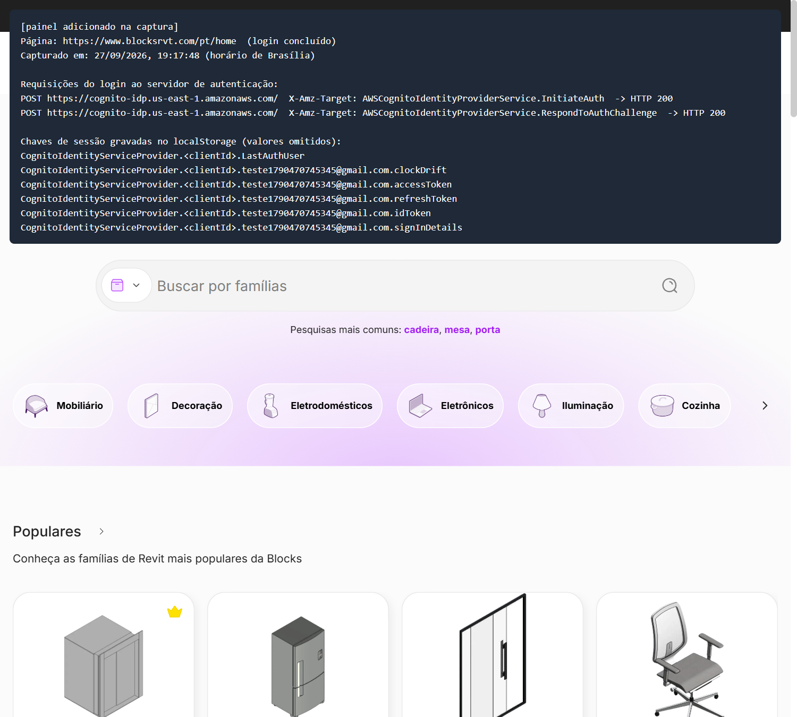

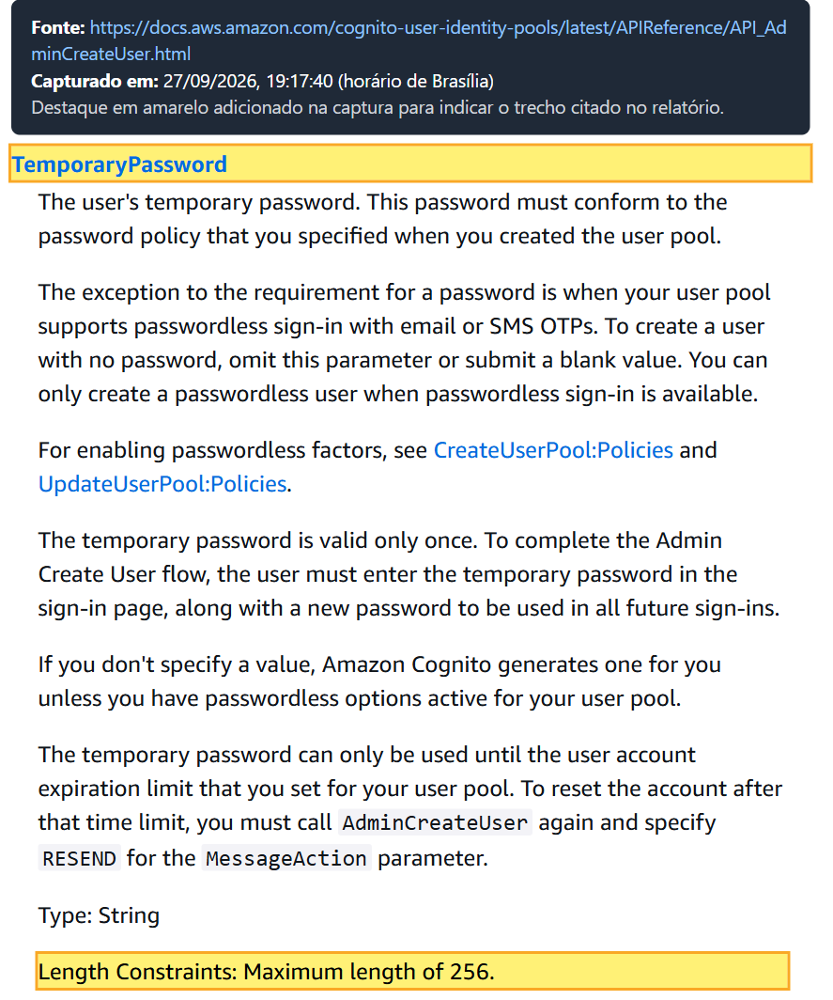

Fonte: [https://docs.aws.amazon.com/cognito-user-identity-pools/latest/APIReference/API_AdminCreateUser.html](https://docs.aws.amazon.com/cognito-user-identity-pools/latest/APIReference/API_AdminCreateUser.html)

**Observação (UX, sem classificação como bug):** o login com senha errada exibe apenas "Algo deu errado. Por favor, tente novamente.", a mesma mensagem genérica do Bug #07, em vez de algo como "Email ou senha incorretos".

### Cenário de Teste CT-10 - Variações de nome, país, área de atuação e email

- Técnica: **partição de equivalência** com valores reais e de limite, validados na tela (nenhum cadastro é enviado). Nos casos recusados, o assert é em duas etapas: botão desabilitado e, depois de trocar pelo valor válido, botão habilitado.

| Campo | Caso | Esperado | Resultado |
|-------|------|----------|-----------|
| Nome | 1 caractere | Aceitar | Passou |
| Nome | Apóstrofo, hífen e acento (`Ana-Luíza D'Ávila Conceição`) | Aceitar | Passou |
| Nome | 300 caracteres | Aceitar (o campo não define tamanho máximo) | Passou |
| Nome | Só espaços | Recusar | Passou |
| País | Digitado sem escolher da lista | Recusar (o texto é descartado) | Passou |
| Área de atuação | Duas áreas marcadas | Aceitar | Passou |
| Email | Com `+tag` (`nome+tag@gmail.com`) | Aceitar | Passou |
| Email | Com subdomínio (`@mail.empresa.com.br`) | Aceitar | Passou |
| Email | 254 caracteres (tamanho máximo, RFC 5321) | Aceitar | Passou |
| Email | Espaços antes e depois | Recusar | Passou |

**Observações (sem classificação como bug):**
- **Nome só com espaços:** o botão fica desabilitado **sem nenhuma mensagem** explicando o motivo, o mesmo padrão da sugestão de UX do CT-04. Evidência: [evidencias/cypress/cadastroCampos.cy.js/nome-so-espacos.png](evidencias/cypress/cadastroCampos.cy.js/nome-so-espacos.png)
- **Nome sem tamanho máximo definido:** o campo não tem o atributo `maxlength` e o formulário não exibe regra de tamanho; um nome de 300 caracteres (valor escolhido para o teste, bem acima de um nome real) foi aceito pelo formulário e pelo servidor (sondagem de 27/09/2026). Vale definir um limite para evitar problemas de exibição e de armazenamento.
- **Email com espaços antes e depois** (comum ao copiar e colar) é recusado como inválido em vez de ter os espaços removidos automaticamente. Evidência: [evidencias/cypress/cadastroCampos.cy.js/email-com-espacos.png](evidencias/cypress/cadastroCampos.cy.js/email-com-espacos.png)

Evidência das duas áreas marcadas: [evidencias/cypress/cadastroCampos.cy.js/duas-areas-marcadas.png](evidencias/cypress/cadastroCampos.cy.js/duas-areas-marcadas.png)

### Cenário de Teste CT-11 - Responsividade

- Objetivo: o formulário deve funcionar sem rolagem horizontal e sem conteúdo fora da tela em celular, tablet e desktop. As larguras de 320 px e 640 px equivalem a uma tela de 1280 px com **zoom de 400%** e **200%**.
- **Como os aparelhos foram emulados:** do mesmo modo que o modo de dispositivo do DevTools do Chrome, pelo protocolo do Chrome (CDP): tamanho da tela, **toque** (a página passa a detectar `pointer: coarse` e eventos de toque) e **user agent do aparelho**. Cada teste confirma, de dentro da página, que a emulação está ativa antes de verificar o layout.
- **Limitação:** é uma emulação no motor do Chrome. A densidade de tela (`devicePixelRatio`) não chega à página, que roda dentro do quadro do Cypress (não afeta o layout), e o teste não substitui a verificação em aparelho real, principalmente no Safari do iOS.

| Dispositivo / tela | Tamanho | Toque e user agent | Sem rolagem horizontal | Nada fora da tela | Botão de cadastro alcançável | Toque marca a caixa de seleção | Resultado |
|--------------------|---------|--------------------|------------------------|-------------------|------------------------------|--------------------------------|-----------|
| iPhone SE | 375 x 667 | iOS | Sim | Sim | Sim | Sim | Passou |
| iPhone 14 | 390 x 844 | iOS | Sim | Sim | Sim | Sim | Passou |
| Galaxy S20 | 360 x 800 | Android | Sim | Sim | Sim | Sim | Passou |
| iPad | 820 x 1180 | iPadOS | Sim | Sim | Sim | Sim | Passou |
| Desktop com zoom de 400% | 320 x 568 | - | Sim | Sim | Sim | - | Passou |
| Desktop com zoom de 200% | 640 x 400 | - | Sim | Sim | Sim | - | Passou |
| Desktop | 1280 x 800 | - | Sim | Sim | Sim | - | Passou |
| Desktop | 1920 x 1080 | - | Sim | Sim | Sim | - | Passou |

**Resultado:** Passou (8/8). O formulário se adapta a todos os tamanhos testados e funciona com toque nos aparelhos emulados.

**Observações (sem classificação como bug):**
- **Seta do campo "Como você ficou sabendo sobre a Blocks?":** com 320 px de largura, o texto ocupa todo o campo e a seta some, e no iPhone SE o texto encosta nela; o usuário pode não perceber que o campo é uma lista. Os campos de seleção também usam fonte menor que os demais (12 px no celular). Evidências: [evidencias/cypress/responsividade.cy.js/resp-desktop-com-zoom-de-400-320-px-1-topo.png](evidencias/cypress/responsividade.cy.js/resp-desktop-com-zoom-de-400-320-px-1-topo.png) e [evidencias/cypress/responsividade.cy.js/resp-iphone-se-1-topo.png](evidencias/cypress/responsividade.cy.js/resp-iphone-se-1-topo.png)
- **Teclado do celular no campo de email:** o campo é `type="text"`, então o celular não abre o teclado próprio para email (com @).

Evidências (topo e rodapé da página em cada tamanho):

- iPhone SE: [evidencias/cypress/responsividade.cy.js/resp-iphone-se-1-topo.png](evidencias/cypress/responsividade.cy.js/resp-iphone-se-1-topo.png) e [evidencias/cypress/responsividade.cy.js/resp-iphone-se-2-rodape.png](evidencias/cypress/responsividade.cy.js/resp-iphone-se-2-rodape.png)
- iPhone 14: [evidencias/cypress/responsividade.cy.js/resp-iphone-14-1-topo.png](evidencias/cypress/responsividade.cy.js/resp-iphone-14-1-topo.png) e [evidencias/cypress/responsividade.cy.js/resp-iphone-14-2-rodape.png](evidencias/cypress/responsividade.cy.js/resp-iphone-14-2-rodape.png)
- Galaxy S20: [evidencias/cypress/responsividade.cy.js/resp-galaxy-s20-1-topo.png](evidencias/cypress/responsividade.cy.js/resp-galaxy-s20-1-topo.png) e [evidencias/cypress/responsividade.cy.js/resp-galaxy-s20-2-rodape.png](evidencias/cypress/responsividade.cy.js/resp-galaxy-s20-2-rodape.png)
- iPad: [evidencias/cypress/responsividade.cy.js/resp-ipad-1-topo.png](evidencias/cypress/responsividade.cy.js/resp-ipad-1-topo.png) e [evidencias/cypress/responsividade.cy.js/resp-ipad-2-rodape.png](evidencias/cypress/responsividade.cy.js/resp-ipad-2-rodape.png)
- Desktop com zoom de 400%: [evidencias/cypress/responsividade.cy.js/resp-desktop-com-zoom-de-400-320-px-1-topo.png](evidencias/cypress/responsividade.cy.js/resp-desktop-com-zoom-de-400-320-px-1-topo.png) e [evidencias/cypress/responsividade.cy.js/resp-desktop-com-zoom-de-400-320-px-2-rodape.png](evidencias/cypress/responsividade.cy.js/resp-desktop-com-zoom-de-400-320-px-2-rodape.png)
- Desktop com zoom de 200%: [evidencias/cypress/responsividade.cy.js/resp-desktop-com-zoom-de-200-640-px-1-topo.png](evidencias/cypress/responsividade.cy.js/resp-desktop-com-zoom-de-200-640-px-1-topo.png) e [evidencias/cypress/responsividade.cy.js/resp-desktop-com-zoom-de-200-640-px-2-rodape.png](evidencias/cypress/responsividade.cy.js/resp-desktop-com-zoom-de-200-640-px-2-rodape.png)
- Desktop 1280 px: [evidencias/cypress/responsividade.cy.js/resp-desktop-1280-px-1-topo.png](evidencias/cypress/responsividade.cy.js/resp-desktop-1280-px-1-topo.png) e [evidencias/cypress/responsividade.cy.js/resp-desktop-1280-px-2-rodape.png](evidencias/cypress/responsividade.cy.js/resp-desktop-1280-px-2-rodape.png)
- Desktop 1920 px: [evidencias/cypress/responsividade.cy.js/resp-desktop-1920-px-1-topo.png](evidencias/cypress/responsividade.cy.js/resp-desktop-1920-px-1-topo.png) e [evidencias/cypress/responsividade.cy.js/resp-desktop-1920-px-2-rodape.png](evidencias/cypress/responsividade.cy.js/resp-desktop-1920-px-2-rodape.png)

### Cenário de Teste CT-12 - Feedback do formulário

- Referência: diretrizes de usabilidade da Nielsen Norman Group para erros em formulários e as 10 heurísticas de Nielsen (fontes e prints no Bug #09 e abaixo).
- Nenhum cadastro é enviado nesta spec (`cadastroFeedback.cy.js`). O envio com duplo clique está no Bug #09.

| Caso | Resultado |
|------|-----------|
| O olho de cada campo de senha mostra e oculta **somente o próprio campo**, sem perder o valor digitado, e o ícone alterna entre olho aberto e fechado | Passou |
| O erro do email aparece para email inválido e **some quando o email é corrigido** | Passou |
| Nome, sobrenome e email deixados em branco não exibem mensagem ao sair do campo; só o botão de cadastro fica desabilitado | Passou (comportamento atual documentado) |

**Resultado:** Passou (3/3).

**Observações (UX, sem classificação como bug):**
- **Erro exibido antes de o usuário terminar de digitar:** a mensagem "This is not a valid email." aparece já na **primeira tecla** digitada no campo de email, com o campo ainda em foco. O mesmo acontece com as regras de senha. A Nielsen Norman Group recomenda o contrário: *"In most cases, avoid showing an error until the user has finished with the field and moved to the next field. It's frustrating to see an error message before being given the opportunity to finish typing."* (diretriz 7, "Don't Validate Fields Before Input is Complete"). Sugestão: validar ao sair do campo e, depois do primeiro erro, revalidar a cada tecla para mostrar a correção. Evidência: [evidencias/cypress/cadastroFeedback.cy.js/erro-email-na-primeira-tecla.png](evidencias/cypress/cadastroFeedback.cy.js/erro-email-na-primeira-tecla.png)
- **Campo obrigatório em branco sem mensagem:** o mesmo padrão já observado no CT-04 (aceite da política) e no CT-10 (nome só com espaços). O botão fica desabilitado, mas nada indica qual campo falta. Evidência: [evidencias/cypress/cadastroFeedback.cy.js/obrigatorios-em-branco-sem-mensagem.png](evidencias/cypress/cadastroFeedback.cy.js/obrigatorios-em-branco-sem-mensagem.png)
- **Regras de senha uma de cada vez:** a senha mostra só a primeira regra não atendida (ex: "Password must contain at least one uppercase letter"); o usuário descobre as demais uma a uma. Uma lista com todas as regras e o estado de cada uma evitaria tentativas repetidas.
- **Mostrar/ocultar senha:** funciona bem e de forma independente em cada campo.

Evidências do olho da senha: [evidencias/cypress/cadastroFeedback.cy.js/olho-mostrando-password.png](evidencias/cypress/cadastroFeedback.cy.js/olho-mostrando-password.png) e [evidencias/cypress/cadastroFeedback.cy.js/olho-mostrando-confirm_password.png](evidencias/cypress/cadastroFeedback.cy.js/olho-mostrando-confirm_password.png)

**Print da fonte (capturado em 27/09/2026, com o link de origem no topo):**

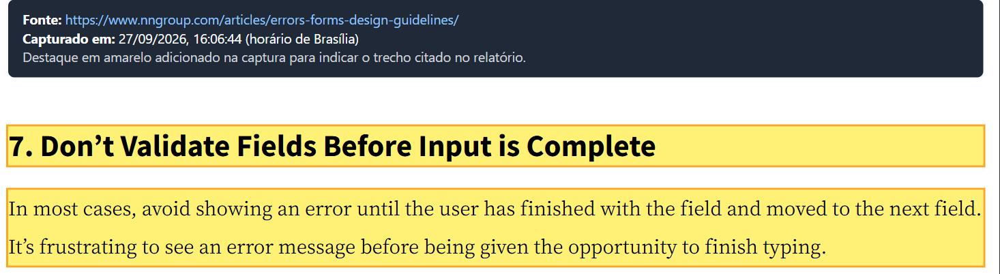

---

## 5. Resultados Gerais da Execução

```
Resumo da Execução
━━━━━━━━━━━━━━━━━━━━━━━━━━━━━━━━━━━━━━━━
Total de Testes:     5
Testes Aprovados:    5
Testes Reprovados:   0
Taxa de Sucesso:     100%
Tempo Total:         ~36 segundos
━━━━━━━━━━━━━━━━━━━━━━━━━━━━━━━━━━━━━━━━
```

### Reexecução - 26/09/2026

A suíte foi executada novamente para verificar se continuava válida diante de mudanças no site.

**Manutenção necessária:** o texto do botão do banner de cookies mudou de "Permitir todos" para "Aceitar todos", o que fazia todos os cenários falharem logo na abertura da página. O clique foi centralizado no comando customizado `cy.aceitarCookies()` (`cypress/support/commands.js`), de forma que uma nova mudança de texto exija ajuste em um único ponto.

**Outras mudanças observadas no formulário** (sem impacto nos testes):
- Nova opção "Educação" em "Qual sua área de atuação?"
- Novo estilo visual do botão de submissão

```
Resumo da Reexecução (26/09/2026)
━━━━━━━━━━━━━━━━━━━━━━━━━━━━━━━━━━━━━━━━
Total de Testes:     5
Testes Aprovados:    5
Testes Reprovados:   0
Taxa de Sucesso:     100%
Tempo Total:         ~32 segundos
━━━━━━━━━━━━━━━━━━━━━━━━━━━━━━━━━━━━━━━━
```

As evidências (screenshots) deste relatório são da reexecução de 26/09/2026 e da ampliação de 27/09/2026.

### Ampliação da Suíte - 27/09/2026

Novos cenários (CT-06 a CT-12) e login no CT-01, todos na suíte principal (`npm test`):

```
Resumo da Suíte Principal (27/09/2026)
━━━━━━━━━━━━━━━━━━━━━━━━━━━━━━━━━━━━━━━━
Total de Testes:     47
Testes Aprovados:    47
Testes Reprovados:   0
Taxa de Sucesso:     100%
Tempo Total:         ~3 min 33 s
━━━━━━━━━━━━━━━━━━━━━━━━━━━━━━━━━━━━━━━━
```

| Spec | Testes | Cenários |
|------|--------|----------|
| `cadastroCompleto.cy.js` | 1 | CT-01 (cadastro + login) |
| `cadastroEmailInv.cy.js` | 3 | CT-02, CT-03 e CT-06 |
| `cadastroSemTermo.cy.js` | 1 | CT-04 |
| `cadastroSenhaDif.cy.js` | 1 | CT-05 |
| `cadastroSenha.cy.js` | 10 | CT-07 e CT-09 |
| `cadastroObrigatorios.cy.js` | 10 | CT-08 |
| `cadastroCampos.cy.js` | 10 | CT-10 |
| `responsividade.cy.js` | 8 | CT-11 |
| `cadastroFeedback.cy.js` | 3 | CT-12 |

### Testes de Bugs Conhecidos (`npm run test:bugs`)

Suíte separada (`cypress/bugs-conhecidos/`) com a regressão dos bugs #07 a #09. Assim como os testes de idioma, ela valida o comportamento **esperado**: hoje os 3 testes falham de propósito e devem passar quando os bugs forem corrigidos. Fica fora da suíte principal e roda em um job próprio no CI, sem afetar o selo.

| Teste | Esperado | Resultado hoje |
|-------|----------|----------------|
| Bug #07 - primeiro login após o cadastro | Nenhum aviso "Algo deu errado" | Falhou (o aviso aparece) |
| Bug #08 - senha de 257 caracteres | Mensagem de erro e permanência no cadastro | Falhou (redireciona para o login como se fosse sucesso) |
| Bug #09 - duplo clique no cadastro | Uma única requisição de criação | Falhou (2 requisições: 201 e 500) |

### Testes de Idioma (`npm run test:idiomas`)

Suíte separada (`cypress/idiomas/idiomas.cy.js`) que valida o comportamento **esperado** de internacionalização da página de cadastro em português, espanhol e inglês. A página em inglês funciona como **controle**. Os testes que falham hoje são a prova automatizada dos bugs e devem passar quando os textos forem corrigidos; por isso a suíte fica fora da execução principal (`npm test`).

| Verificação | `/pt` | `/es` | `/en` (controle) |
|-------------|-------|-------|------------------|
| Mensagem de email inválido no idioma da página (Bug #01) | Falhou | Falhou | Passou |
| Mensagem de senhas diferentes no idioma da página (Bug #02) | Falhou | Falhou | Passou |
| Título no idioma da página e sem texto de login (Bugs #03 e #04) | Falhou ("Sign Up") | Falhou ("Iniciar Sesión") | Passou |
| Botão de cadastro sem texto de login (Bug #04) | Falhou ("Entrar") | Falhou ("Iniciar") | Falhou ("Sign in") |
| Link da política no idioma da página (Bug #06) | Passou | Falhou ("política de privacidade") | Passou |

```
Resumo dos Testes de Idioma (26/09/2026)
━━━━━━━━━━━━━━━━━━━━━━━━━━━━━━━━━━━━━━━━
Total de Testes:     15
Aprovados:           5
Reprovados:          10 (todos correspondem a bugs registrados)
Tempo Total:         ~33 segundos
━━━━━━━━━━━━━━━━━━━━━━━━━━━━━━━━━━━━━━━━
```

---

## 6. Bugs Identificados

### Bug #01 - Internacionalização (Email Inválido)

| Campo | Detalhes |
|-------|----------|
| **Descrição** | Mensagem de validação de email inválido aparece em inglês ("This is not a valid email.") mesmo quando a página está configurada em português |
| **Ambiente** | Página localizada em português (`/pt/registrar`) e espanhol (`/es/registrar`) |
| **Localização** | Campo de email do formulário de cadastro |
| **Comportamento Atual** | Mensagem exibida: "This is not a valid email." |
| **Comportamento Esperado** | Mensagem em português: "Este não é um e-mail válido." |
| **Severidade** | Baixa |
| **Impacto** | Experiência do usuário - Inconsistência de idioma |
| **Status** | Identificado; confirmado automaticamente em `/pt` e `/es` pelo teste de idiomas (26/09/2026) |
| **Evidência** | [evidencias/cypress/cadastroEmailInv.cy.js/cadastroInvalido.png](evidencias/cypress/cadastroEmailInv.cy.js/cadastroInvalido.png), [evidencias/idiomas/idioma-pt-email-invalido.png](evidencias/idiomas/idioma-pt-email-invalido.png) e [evidencias/idiomas/idioma-es-email-invalido.png](evidencias/idiomas/idioma-es-email-invalido.png) |

### Bug #02 - Internacionalização (Senhas Diferentes)

| Campo | Detalhes |
|-------|----------|
| **Descrição** | Mensagem de validação de senhas diferentes aparece em inglês ("Passwords must match") mesmo quando a página está configurada em português |
| **Ambiente** | Página localizada em português (`/pt/registrar`) e espanhol (`/es/registrar`) |
| **Localização** | Campo de confirmação de senha do formulário de cadastro |
| **Comportamento Atual** | Mensagem exibida: "Passwords must match" |
| **Comportamento Esperado** | Mensagem em português: "As senhas devem coincidir" |
| **Severidade** | Baixa |
| **Impacto** | Experiência do usuário - Inconsistência de idioma |
| **Status** | Identificado; confirmado automaticamente em `/pt` e `/es` pelo teste de idiomas (26/09/2026) |
| **Evidência** | [evidencias/cypress/cadastroSenhaDif.cy.js/cadastroSenhaDif.png](evidencias/cypress/cadastroSenhaDif.cy.js/cadastroSenhaDif.png), [evidencias/idiomas/idioma-pt-senhas-diferentes.png](evidencias/idiomas/idioma-pt-senhas-diferentes.png) e [evidencias/idiomas/idioma-es-senhas-diferentes.png](evidencias/idiomas/idioma-es-senhas-diferentes.png) |

### Bug #03 - Internacionalização (Títulos e Botões em Inglês)

| Campo | Detalhes |
|-------|----------|
| **Descrição** | Títulos e botões das telas de cadastro e login aparecem em inglês mesmo com a página em português |
| **Ambiente** | Página localizada em português (`/pt/registrar` e `/pt/login`) |
| **Localização** | Título do formulário de cadastro, link "Já possui uma conta?" e título/botão da tela de login |
| **Comportamento Atual** | Textos exibidos: "Sign Up" (título do cadastro) e "Log in" (link do cadastro, título e botão do login) |
| **Comportamento Esperado** | Textos em português, ex: "Cadastro" / "Criar conta" e "Entrar" |
| **Severidade** | Baixa |
| **Impacto** | Experiência do usuário - Inconsistência de idioma |
| **Status** | Identificado (reexecução de 26/09/2026; comportamento já presente em 22/01/2026) |
| **Evidência** | [evidencias/cypress/cadastroCompleto.cy.js/cadastroCompleto.png](evidencias/cypress/cadastroCompleto.cy.js/cadastroCompleto.png) e [evidencias/cypress/cadastroCompleto.cy.js/aposCadastro.png](evidencias/cypress/cadastroCompleto.cy.js/aposCadastro.png) |

### Bug #04 - Textos de Login na Tela de Cadastro

| Campo | Detalhes |
|-------|----------|
| **Descrição** | A tela de cadastro usa textos da ação de login (entrar) no botão de submissão, nos três idiomas, e no título da página em espanhol |
| **Ambiente** | Páginas `/pt/registrar`, `/es/registrarse` e `/en/register` |
| **Localização** | Botão de submissão do formulário de cadastro e título do formulário (`/es`) |
| **Comportamento Atual** | Botão: "Entrar" (`/pt`), "Iniciar" (`/es`) e "Sign in" (`/en`). Título em `/es`: "Iniciar Sesión" |
| **Comportamento Esperado** | Textos que descrevam a ação de cadastro, ex: "Cadastrar" / "Criar conta", "Registrarse" / "Crear cuenta" e "Sign up" / "Create account" |
| **Severidade** | Baixa |
| **Impacto** | Experiência do usuário - o usuário pode entender que está na tela de login |
| **Status** | Identificado (em `/pt` desde 22/01/2026; `/es` e `/en` confirmados pelo teste de idiomas em 26/09/2026) |
| **Evidência** | [evidencias/idiomas/idioma-pt-titulo-e-botao.png](evidencias/idiomas/idioma-pt-titulo-e-botao.png), [evidencias/idiomas/idioma-es-titulo-e-botao.png](evidencias/idiomas/idioma-es-titulo-e-botao.png) e [evidencias/idiomas/idioma-en-titulo-e-botao.png](evidencias/idiomas/idioma-en-titulo-e-botao.png) |

### Bug #05 - Segurança / Privacidade (Exposição de Dados Pessoais pela API de Verificação de Email)

| Campo | Detalhes |
|-------|----------|
| **Descrição** | A API consultada pelo formulário para verificar se o email já está em uso responde, **sem autenticação**, com dados pessoais do titular da conta em vez de apenas indicar se o email existe |
| **Ambiente** | API `https://api.blocksrvt.com/v1/user/email/<email>` (chamada pela página `/pt/registrar` ao digitar o email) |
| **Localização** | Verificação de disponibilidade do campo de email do formulário de cadastro |
| **Comportamento Atual** | Para um email cadastrado, a resposta é `HTTP 200` com: identificador interno (`id`), `locale`, `country`, **endereço IP**, **geolocalização do IP** (cidade, CEP, região, latitude e longitude), provedor/ASN da conexão, fuso horário, datas de cadastro e de aceite dos termos, área de atuação, origem do cadastro, situação de estudante e se a conta é premium |
| **Comportamento Esperado** | Responder apenas se o email está disponível (ex: `{ "available": false }`), sem retornar dados do titular, e com proteção contra consultas em massa (ex: limite de requisições) |
| **Severidade** | **Alta** |
| **Impacto** | Privacidade e conformidade com a LGPD: qualquer pessoa pode (1) descobrir se um email possui conta na Blocks (enumeração de usuários) e (2) obter dados pessoais do titular, incluindo IP e localização aproximada |
| **Status** | Identificado em 26/09/2026 |
| **Evidência** | [evidencias/bug05-api-resposta-mascarada.png](evidencias/bug05-api-resposta-mascarada.png) |

**Como foi identificado:** durante a manutenção da suíte, ao investigar a espera fixa `cy.wait(500)` após digitar o email, foi observado que a página faz uma requisição `GET` à API acima para validar o email. A evidência foi feita **somente com uma conta criada pela própria suíte de testes** (CT-01, email `teste1790470745345@gmail.com`), sem nenhuma exploração além da observação da resposta. A verificação complementar com uma conta que não foi criada pela suíte, descrita abaixo, registrou apenas resultados sim/não, sem nenhum valor pessoal.

**Evidência (resposta real da API):** os valores pessoais foram mascarados e os grupos sem dado pessoal (moeda, dados do país, idioma, continente, segurança e fuso horário) foram recolhidos na própria captura. Os nomes dos campos pessoais estão destacados em amarelo.

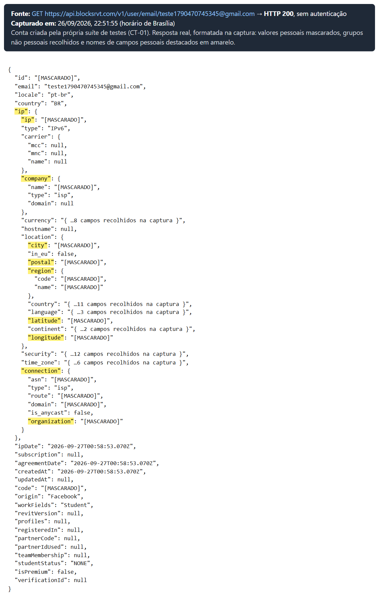

**Verificação de que os dados são do titular, e não de quem consulta (27/09/2026):** como as contas da suíte foram criadas na mesma máquina e rede que faz a consulta, o IP e a localização retornados coincidiam com os do testador, o que deixava em aberto se a API geolocalizava quem consulta. Para descartar essa hipótese, foi consultado um email de exemplo que já constava do projeto original como "email já em uso" e que **não foi criado pela suíte**. A comparação foi feita apenas com resultados sim/não e nomes de campos; **nenhum valor pessoal dessa conta foi registrado, reproduzido ou capturado em print**.

| Verificação | Resultado |
|-------------|-----------|
| Resposta sem autenticação | `HTTP 200`, com os mesmos 22 campos da conta própria |
| IP retornado igual ao IP de quem consultou | Não |
| Localização retornada igual à de quem consultou | Não |
| Data do registro do IP (`ipDate`) e da hora local (`time_zone.current_time`) | Iguais à data de criação da conta (`createdAt`), em 2024 |

Conclusão: IP, provedor e localização são **gravados no cadastro e devolvidos a qualquer pessoa que informe o email**. São dados do titular da conta, e não de quem faz a consulta.

**Possível CPF no campo `partnerCode`:** na mesma verificação, o campo `partnerCode` retornou um número de **11 dígitos com dígitos verificadores válidos de CPF**. O número não foi consultado em nenhuma base externa. Se for o CPF do titular, trata-se de dado pessoal identificador direto (LGPD, Art. 5º, I), o que **agrava a severidade** deste bug. Recomenda-se que a Blocks confirme internamente o conteúdo desse campo.

**Complemento:** a resposta do próprio cadastro (`POST https://api.blocksrvt.com/v1/user`, `HTTP 201`) também devolve ao navegador o mesmo bloco `ip` (endereço IP, provedor e geolocalização), observado no teste do Bug #09. Como só chega a quem acabou de se cadastrar, o impacto é menor, mas vale revisar pelo mesmo princípio da necessidade (Art. 6º, III).

#### Embasamento legal - Lei Geral de Proteção de Dados Pessoais (Lei nº 13.709/2018)

Fonte oficial: [https://www.planalto.gov.br/ccivil_03/_ato2015-2018/2018/lei/l13709.htm](https://www.planalto.gov.br/ccivil_03/_ato2015-2018/2018/lei/l13709.htm)

| Dispositivo | Texto da lei | Relação com o achado |
|-------------|--------------|----------------------|
| **Art. 5º, I** | "dado pessoal: informação relacionada a pessoa natural identificada ou identificável;" | Email, IP, geolocalização e identificador da conta são informações relacionadas a uma pessoa natural identificável, portanto dados pessoais |
| **Art. 6º, III** | "necessidade: limitação do tratamento ao mínimo necessário para a realização de suas finalidades, com abrangência dos dados pertinentes, proporcionais e não excessivos em relação às finalidades do tratamento de dados;" | Para informar se um email está disponível, basta um sim/não; devolver IP, localização e perfil da conta excede o necessário |
| **Art. 6º, VII** | "segurança: utilização de medidas técnicas e administrativas aptas a proteger os dados pessoais de acessos não autorizados e de situações acidentais ou ilícitas de destruição, perda, alteração, comunicação ou difusão;" | A rota não exige autenticação, permitindo o acesso de qualquer pessoa aos dados |
| **Art. 6º, VIII** | "prevenção: adoção de medidas para prevenir a ocorrência de danos em virtude do tratamento de dados pessoais;" | A exposição facilita enumeração de contas e uso dos dados para golpes direcionados (ex: phishing com dados reais do usuário) |
| **Art. 46** | "Os agentes de tratamento devem adotar medidas de segurança, técnicas e administrativas aptas a proteger os dados pessoais de acessos não autorizados e de situações acidentais ou ilícitas de destruição, perda, alteração, comunicação ou qualquer forma de tratamento inadequado ou ilícito." | Obrigação legal de proteger os dados contra acessos não autorizados, que não é atendida pela rota pública |

Complemento - página oficial do Governo Federal sobre a LGPD: [https://www.gov.br/mds/pt-br/acesso-a-informacao/governanca/integridade/campanhas/lgpd](https://www.gov.br/mds/pt-br/acesso-a-informacao/governanca/integridade/campanhas/lgpd), que define: *"O dado pessoal é aquele que possibilita a identificação, direta ou indireta, da pessoa natural. São exemplos de dados pessoais: nome e sobrenome; data e local de nascimento; RG; CPF; retrato em fotografia; endereço residencial; endereço de e-mail; dentre outros."* e lista, entre os princípios da LGPD, **Necessidade**, **Segurança** e **Prevenção**.

> **Observação:** este relatório aponta uma não conformidade técnica com base no texto da lei; a caracterização jurídica definitiva (ex: se configura incidente de segurança nos termos do Art. 48) cabe ao encarregado de dados (DPO) e à assessoria jurídica da Blocks.

**Prints das fontes (capturados em 26/09/2026, com o link de origem no topo de cada imagem):**

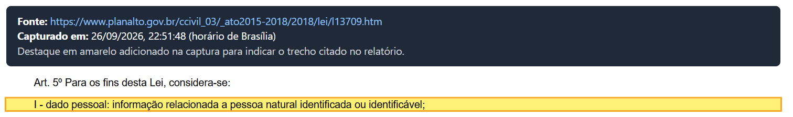

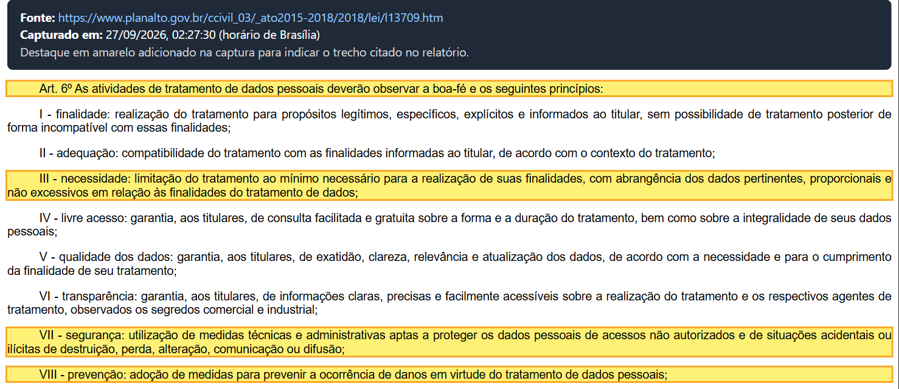

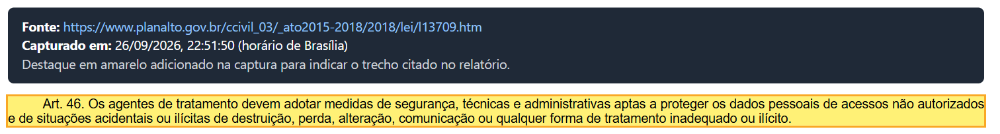

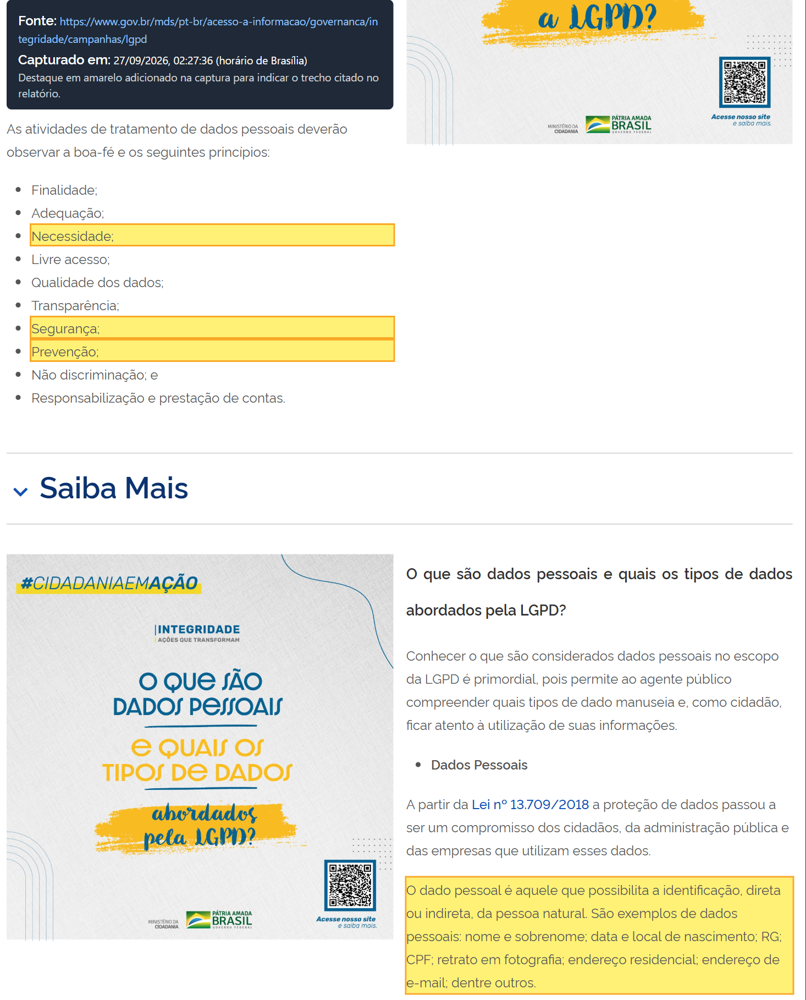

### Bug #06 - Internacionalização (Link da Política de Privacidade em Português na Página em Espanhol)

| Campo | Detalhes |
|-------|----------|
| **Descrição** | Na página de cadastro em espanhol, o link da política de privacidade aparece em português, no meio da frase em espanhol |
| **Ambiente** | Página localizada em espanhol (`/es/registrarse`) |
| **Localização** | Checkbox de aceite dos termos do formulário de cadastro |
| **Comportamento Atual** | Texto exibido: "Acepto la **política de privacidade** y los términos de uso." |
| **Comportamento Esperado** | "Acepto la **política de privacidad** y los términos de uso." |
| **Severidade** | Baixa |
| **Impacto** | Experiência do usuário - Inconsistência de idioma em um texto legal (aceite da política) |
| **Status** | Identificado pelo teste de idiomas em 26/09/2026 |
| **Evidência** | [evidencias/idiomas/idioma-es-politica.png](evidencias/idiomas/idioma-es-politica.png) |

### Bug #07 - Aviso de Erro no Primeiro Login Após o Cadastro

| Campo | Detalhes |
|-------|----------|
| **Descrição** | No primeiro login de uma conta recém-cadastrada, o login funciona, mas a tela exibe o aviso "Algo deu errado. Por favor, tente novamente." junto (ou no lugar) de "Login efetuado com sucesso!" |
| **Ambiente** | `/pt/login` → `/pt/home`, logo após o cadastro em `/pt/registrar` |
| **Localização** | Avisos (toasts) exibidos após o login |
| **Comportamento Atual** | O usuário é autenticado (vai para `/pt/home`, com sessão ativa), mas vê uma mensagem de erro. Em uma das execuções, apenas o aviso de erro ficou visível. Os avisos também aparecem sobrepostos |
| **Comportamento Esperado** | Apenas "Login efetuado com sucesso!", sem mensagem de erro |
| **Reprodução** | **8 de 8** primeiros logins de contas novas (execuções de 27/09/2026, incluindo o teste de regressão `npm run test:bugs`) exibiram o aviso de erro; **0 de 2** logins de uma conta já existente exibiram |
| **Severidade** | Média |
| **Impacto** | Experiência do usuário no primeiro contato com a plataforma: a mensagem de erro sugere que o cadastro ou o login falhou, podendo levar a novas tentativas, abandono ou chamados de suporte |
| **Status** | Identificado em 27/09/2026 |
| **Evidência** | [evidencias/bug07-primeiro-login-aviso-de-erro.png](evidencias/bug07-primeiro-login-aviso-de-erro.png) e [evidencias/bugs-conhecidos/bug07-aviso-de-erro-no-primeiro-login.png](evidencias/bugs-conhecidos/bug07-aviso-de-erro-no-primeiro-login.png) (teste de regressão) |

**Investigação (sem causa confirmada):** durante o primeiro login, todas as requisições à API da Blocks e ao AWS Cognito responderam com sucesso (200/201/204), e não houve erro de JavaScript no console. A causa do aviso não pôde ser identificada pelo lado do cliente e precisa ser analisada pela equipe de desenvolvimento. Na mesma investigação, foram observadas respostas `403 AccessDenied` ao carregar imagens de perfil e de marcas do armazenamento `plugin-storage.nyc3.digitaloceanspaces.com`; não há evidência de que estejam relacionadas ao aviso.

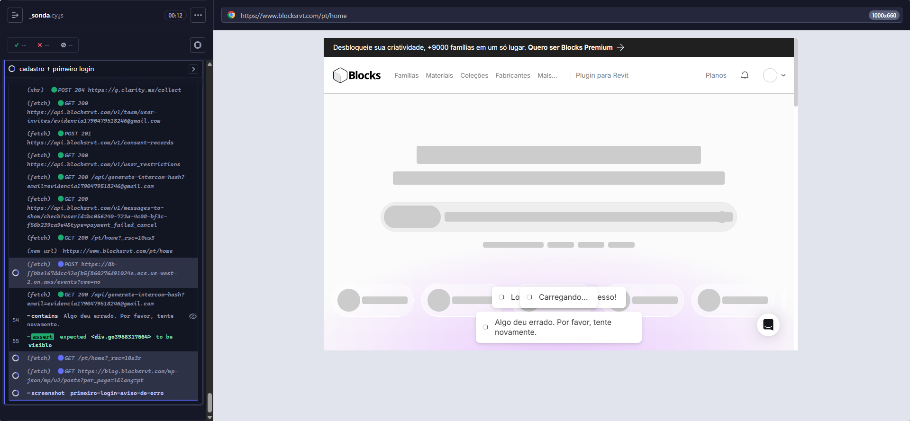

### Bug #08 - Cadastro com Senha Acima de 256 Caracteres Falha em Silêncio

| Campo | Detalhes |
|-------|----------|
| **Descrição** | Com senha de 257 caracteres ou mais, o formulário permite enviar o cadastro, o servidor recusa com erro 500 e, mesmo assim, o usuário é levado para a tela de login como se o cadastro tivesse funcionado. A conta não é criada |
| **Ambiente** | `/pt/registrar` → API `POST https://api.blocksrvt.com/v1/user` |
| **Localização** | Envio do formulário de cadastro (validação de tamanho máximo da senha) |
| **Comportamento Atual** | (1) O formulário não tem limite de tamanho de senha; (2) a API responde `HTTP 500` com `InvalidParameterException: ... Value at 'temporaryPassword' failed to satisfy constraint: Member must have length less than or equal to 256`; (3) a tela redireciona para `/pt/login` sem nenhuma mensagem; (4) a conta não existe (consulta ao email retorna 404) e o login com essa senha também falha sem mensagem |
| **Comportamento Esperado** | O formulário limitar a senha a 256 caracteres (ou informar a regra) e, se o servidor recusar o cadastro, exibir uma mensagem de erro mantendo o usuário na tela de cadastro |
| **Severidade** | Média |
| **Impacto** | O usuário acredita que se cadastrou, mas não consegue entrar e não recebe nenhuma explicação. Além disso, a resposta 500 expõe detalhes internos da implementação (nome do parâmetro e a regra do provedor de autenticação) |
| **Status** | Identificado em 27/09/2026 |
| **Evidência** | [evidencias/bugs-conhecidos/bug08-senha-257-cadastro.png](evidencias/bugs-conhecidos/bug08-senha-257-cadastro.png) |

**Como foi identificado:** no teste de valor-limite da senha no servidor (CT-09), 256 caracteres funcionam e 257 falham. A evidência mostra, no mesmo print, a URL para onde o usuário foi levado (`/pt/login`) e um painel adicionado pelo teste com a resposta real da API.

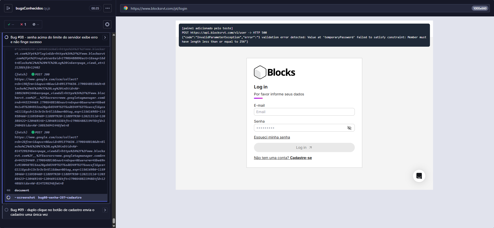

> **Observação (sem evidência capturada, não classificada como bug):** na página em espanhol, as opções "Other" e "ChatGPT / Gemini / Other AI" do campo "¿Cómo te enteraste de Blocks?" aparecem em inglês.

### Bug #09 - Duplo Clique no Botão de Cadastro Envia o Cadastro Duas Vezes

| Campo | Detalhes |
|-------|----------|
| **Descrição** | Um duplo clique no botão de cadastro envia **duas** requisições de criação de conta. Uma delas cria a conta; a outra é recusada pelo servidor com erro 500 porque a conta já existe |
| **Ambiente** | `/pt/registrar` → API `POST https://api.blocksrvt.com/v1/user` |
| **Localização** | Botão de envio do formulário de cadastro |
| **Comportamento Atual** | (1) O botão continua clicável enquanto o primeiro envio está em andamento; (2) um envio recebe `HTTP 201` (conta criada) e o outro `HTTP 500` com `{"code":"UsernameExistsException","error":"User account already exists"}` (a ordem das respostas variou entre as execuções); (3) a tela de login exibe **dois avisos "Carregando..."** empilhados, que permanecem depois de os dois envios terminarem (no cadastro com um clique, nenhum aviso de carregamento fica na tela) |
| **Comportamento Esperado** | Um único envio: desabilitar o botão (ou ignorar novos cliques) assim que o envio começa e exibir um único aviso de progresso, que termina com a confirmação do cadastro |
| **Reprodução** | **6 de 6** execuções em 27/09/2026 (1 exploratória e 5 do teste de regressão `npm run test:bugs`) |
| **Severidade** | Média |
| **Impacto** | Cada duplo clique gera um erro 500 no servidor e avisos duplicados que não se resolvem, deixando o usuário sem saber se o cadastro terminou. Hoje, a única proteção contra uma conta duplicada é a recusa do provedor de autenticação no segundo envio |
| **Referência** | Heurística #5 de Nielsen, Prevenção de Erros: *"Good error messages are important, but the best designs carefully prevent problems from occurring in the first place."*; e heurística #1, Visibilidade do Status do Sistema: *"The design should always keep users informed about what is going on, through appropriate feedback within a reasonable amount of time."* |
| **Status** | Identificado em 27/09/2026 |
| **Evidência** | [evidencias/bugs-conhecidos/bug09-duplo-clique-avisos.png](evidencias/bugs-conhecidos/bug09-duplo-clique-avisos.png) |

**Como foi identificado:** o teste de regressão faz um duplo clique no botão de cadastro com o formulário válido e conta as requisições `POST /v1/user`. O print mostra a URL da tela para onde o usuário foi levado (`/pt/login`), os dois avisos "Carregando..." e um painel adicionado pelo teste com o status e a resposta de cada envio (o corpo da resposta de sucesso é omitido no painel porque traz os dados do Bug #05).

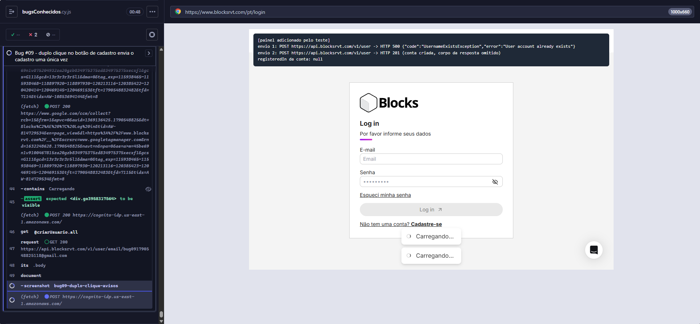

**Observação (não conclusiva):** na conta criada pelo teste exploratório, o campo `registeredIn` da API do Bug #05 aparece como `["Blocks", "Blocks"]`, enquanto em uma conta criada com um clique aparece `["Blocks"]`. Nas 2 contas do teste de regressão consultadas, o campo continuava vazio (`null`) até cerca de 30 minutos depois do cadastro. Não foi possível relacionar o valor duplicado ao duplo clique; vale a equipe de desenvolvimento verificar se o segundo envio grava algum registro antes de ser recusado.

**Prints das fontes (capturados em 27/09/2026, com o link de origem no topo de cada imagem):**

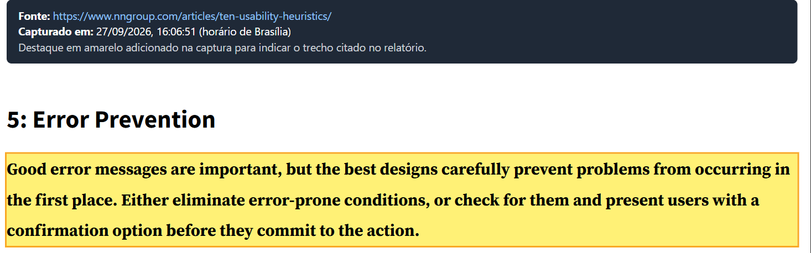

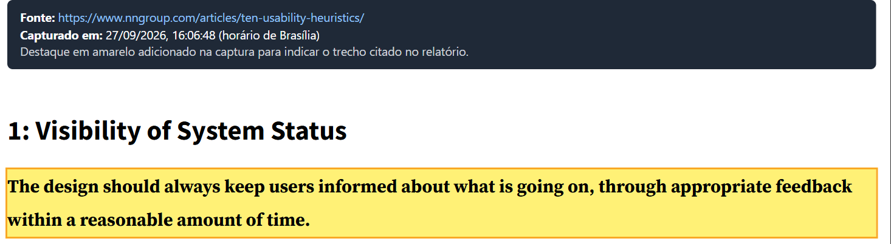

Fontes: [https://www.nngroup.com/articles/ten-usability-heuristics/](https://www.nngroup.com/articles/ten-usability-heuristics/) e [https://www.nngroup.com/articles/errors-forms-design-guidelines/](https://www.nngroup.com/articles/errors-forms-design-guidelines/)

---

## 7. Análise Crítica de Qualidade

### Pontos Positivos:

- Fluxo de cadastro funciona corretamente do ponto de vista funcional
- Validações de campos estão implementadas
- Feedback visual adequado (botão desabilitado, mensagens de erro)
- Redirecionamento após cadastro bem-sucedido funciona conforme esperado

### Pontos de Atenção:

- **Exposição de dados pessoais pela API de verificação de email, sem autenticação (Bug #05, severidade alta, com implicações na LGPD)**
- Inconsistências de internacionalização nas mensagens de validação, títulos, botões e link da política, nas páginas em português e espanhol (confirmadas pelo teste automatizado de idiomas)
- Aviso de erro exibido no primeiro login de contas novas, mesmo com o login funcionando (Bug #07)
- Cadastro com senha acima de 256 caracteres redireciona como sucesso sem criar a conta (Bug #08)
- Validações que bloqueiam o botão sem explicar o motivo (aceite da política, nome só com espaços, campos em branco) e erros exibidos antes de o usuário terminar de digitar (CT-12)
- Duplo clique no botão de cadastro envia o cadastro duas vezes, com erro 500 no segundo envio e avisos "Carregando..." duplicados (Bug #09)
- Textos de login na tela de cadastro nos três idiomas ("Entrar", "Iniciar", "Sign in" e o título "Iniciar Sesión")
- Impacto na percepção de qualidade do produto
- Possível confusão para usuários não familiarizados com inglês

### Observações Técnicas:

Os testes automatizados foram implementados de forma a validar o comportamento atual da aplicação, evitando falhas artificiais causadas por textos fixos. Isso garante que os testes reflitam a realidade do sistema e não quebrem desnecessariamente.

---

## 8. Recomendações

### Prioridade Imediata (Bug #05):

- **Restringir a resposta da API de verificação de email** a um indicador de disponibilidade (ex: `{ "available": false }`), sem dados do titular
- **Aplicar limite de requisições** (rate limiting) na rota para dificultar a enumeração de contas
- **Confirmar o conteúdo do campo `partnerCode`**, que em uma conta apresentou formato de CPF, e deixar de devolvê-lo na rota pública
- **Envolver o encarregado de dados (DPO)** para avaliar o impacto e as obrigações previstas na LGPD

### Curto Prazo:

1. **Padronizar mensagens de validação** conforme o idioma selecionado na página
2. **Revisar todas as mensagens do formulário** para garantir consistência de idioma
3. **Implementar testes de regressão** para validações de idioma (ponto de partida já disponível neste projeto: `npm run test:idiomas`)
4. **Bloquear o envio repetido do cadastro** (Bug #09): desabilitar o botão durante o envio e, no servidor, tratar a conta já existente com uma resposta de negócio (ex: `409`) em vez de erro 500 (a própria documentação do `AdminCreateUser` do Cognito, citada no CT-09, classifica a `UsernameExistsException` como HTTP 400, um erro do cliente, e não do servidor)
5. **Ajustar o momento das mensagens do formulário** (CT-12): validar ao sair do campo, indicar o campo obrigatório que falta e listar todas as regras de senha de uma vez

### Médio Prazo:

6. **Incluir critérios de aceite relacionados a idioma** nos requisitos de funcionalidade
7. **Criar checklist de internacionalização** para novas features
8. **Documentar padrões de mensagens** por idioma suportado

### Longo Prazo:

9. **Implementar testes de internacionalização automatizados** no pipeline CI/CD
10. **Criar biblioteca centralizada de mensagens** por idioma
11. **Realizar auditoria completa de internacionalização** em toda a aplicação

---

## 9. Considerações Finais

O fluxo principal de cadastro encontra-se funcional e estável, atendendo aos requisitos funcionais esperados: os 47 testes da suíte principal passaram. Os pontos que precisam de correção estão registrados como bugs e acompanhados por testes de regressão próprios, que falham de propósito até serem corrigidos.

Os bugs #01 a #04 e #06 (severidade baixa) e os bugs #07 a #09 (severidade média: aviso de erro no primeiro login, cadastro com senha acima de 256 caracteres que falha em silêncio e envio duplicado do cadastro no duplo clique) não impedem o uso da funcionalidade no fluxo principal, mas impactam a experiência do usuário. O Bug #05 é de severidade alta: não afeta o funcionamento do cadastro, mas expõe dados pessoais dos usuários sem autenticação, em desacordo com os princípios de necessidade, segurança e prevenção e com o Art. 46 da LGPD, e deve ser priorizado.

Os testes automatizados implementados cumprem o objetivo proposto no desafio e evidenciam boas práticas de automação e análise de qualidade, incluindo:

- Padrão AAA (Arrange, Act, Assert)
- Data-Driven Testing
- Geração dinâmica de dados
- Evidências visuais (screenshots)
- Relatórios detalhados

De forma geral, a aplicação demonstra estabilidade funcional no fluxo de cadastro, com oportunidades de melhoria em aspectos de experiência de usuário e internacionalização, que poderia elevar ainda mais a percepção de qualidade do produto, e um ponto prioritário de segurança e privacidade de dados (Bug #05) a ser tratado com base na LGPD.

---

## Apêndice - Evidências Visuais (Screenshots)

### CT-01 - Cadastro com sucesso

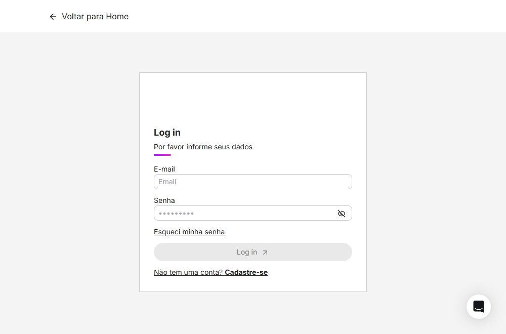

**Descrição:** Prova visual do redirecionamento para página de login após cadastro bem-sucedido

### CT-02 - Cadastro com email inválido

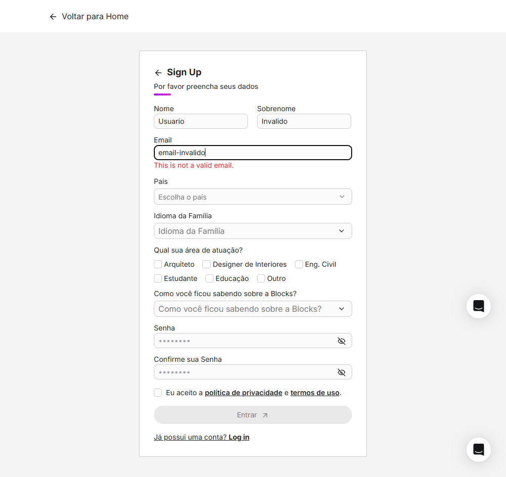

**Descrição:** Prova visual do alerta de email inválido

### CT-03 - Cadastro com email já em uso

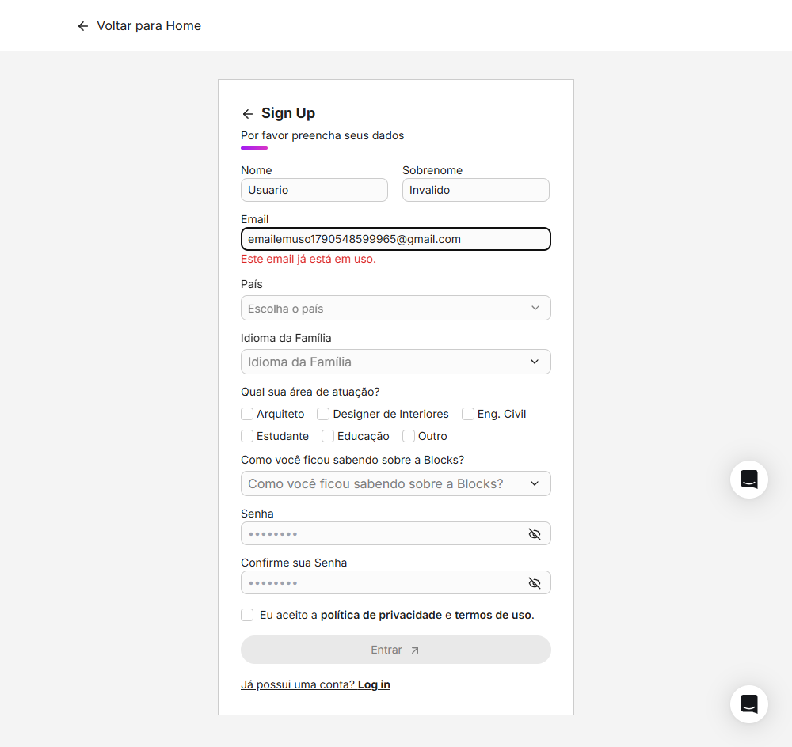

**Descrição:** Prova visual do alerta de email já em uso

### CT-04 - Cadastro sem aceitar política de privacidade

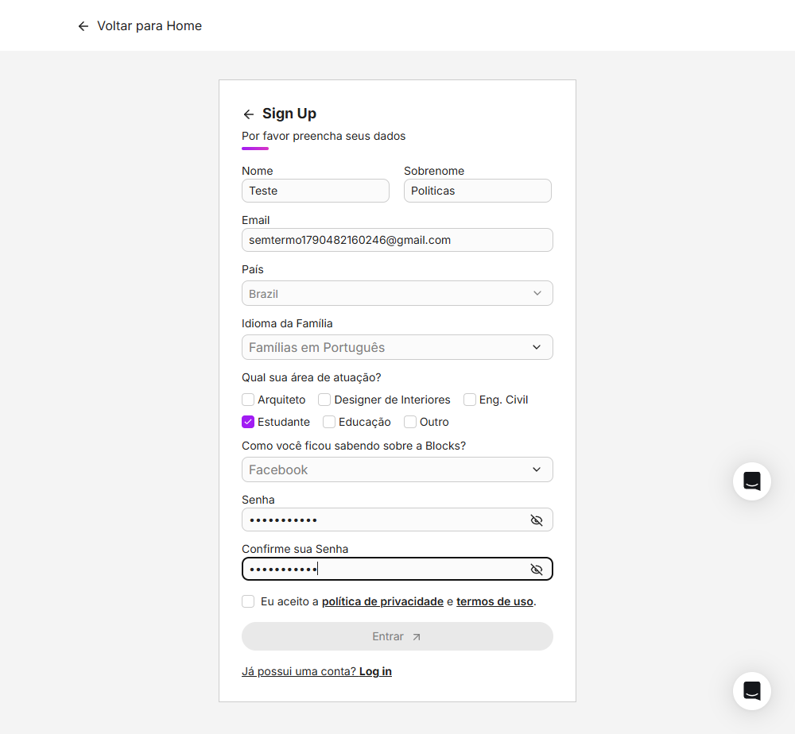

**Descrição:** Prova visual da tentativa de cadastro sem aceitar a política de privacidade

### CT-05 - Cadastro com senhas diferentes

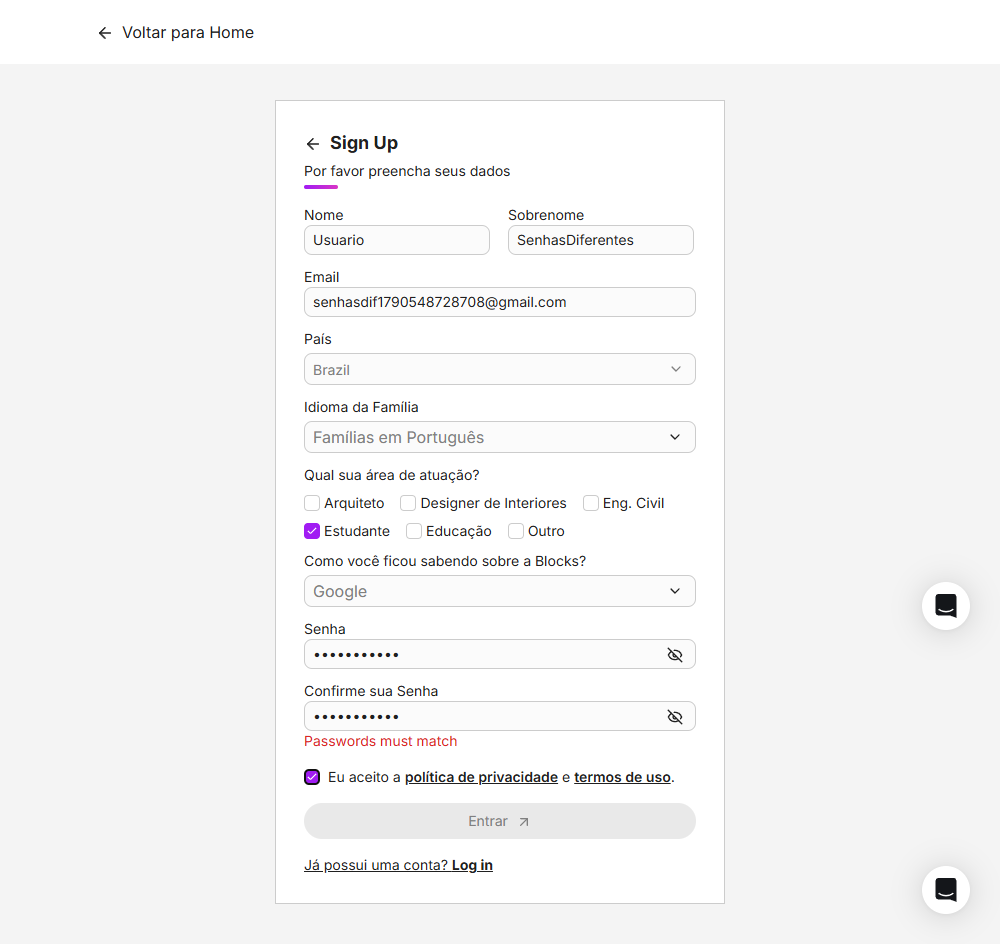

**Descrição:** Prova visual da tentativa de cadastro com senhas diferentes

### Testes de Idioma - Título, Botão e Link da Política

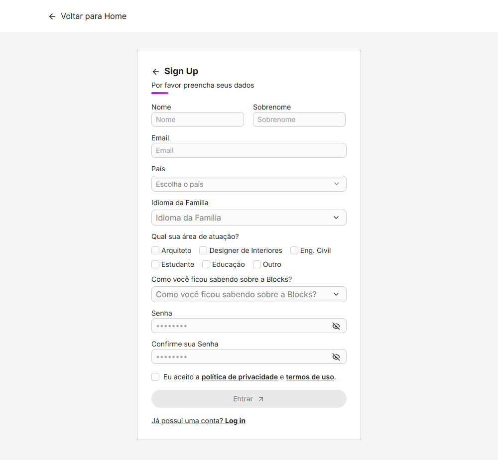

**Descrição (`/pt`):** título "Sign Up" em inglês (Bug #03) e botão "Entrar" (Bug #04)

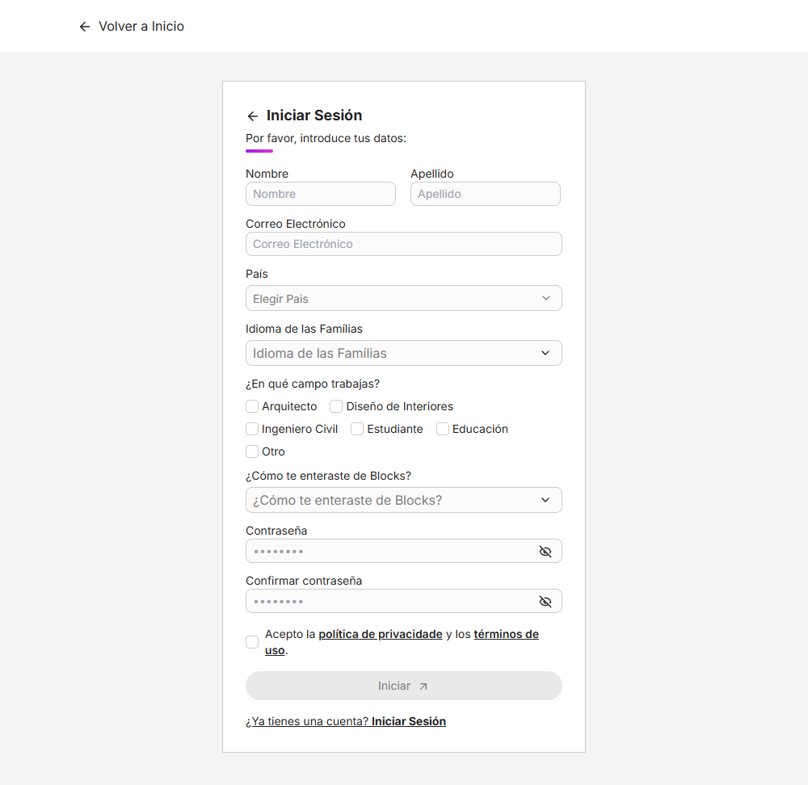

**Descrição (`/es`):** título "Iniciar Sesión" e botão "Iniciar", textos de login (Bug #04); link "política de privacidade" em português (Bug #06)

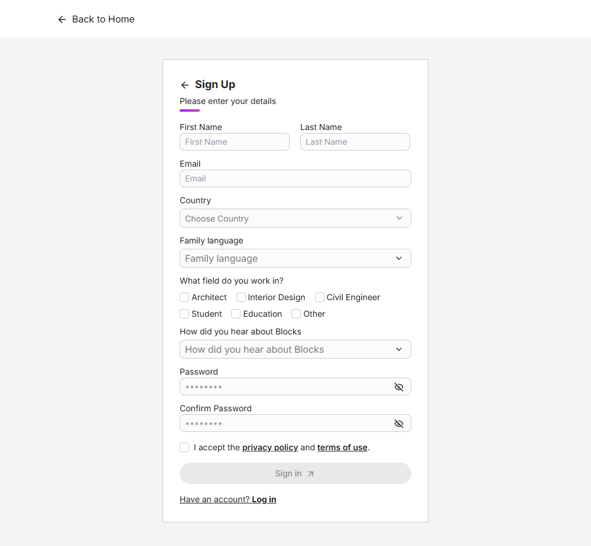

**Descrição (`/en`, controle):** título "Sign Up" correto; botão "Sign in", texto de login (Bug #04)

--- 

**Relatório gerado por:** Cristhian Cintra Barbosa  
**Ferramenta de automação:** Cypress v15.9.0  
**Data:** 22/01/2026 (atualizado em 26/09/2026)
