# Relatório de Testes Automatizados - Blocks

## Informações do Projeto

| Campo | Descrição |
|-------|-----------|
| **Projeto** | Blocks - Página de Cadastro de Usuários |
| **URL** | https://www.blocksrvt.com/pt/registrar |
| **Autor** | Cristhian Cintra Barbosa |
| **Ferramenta** | Cypress v15.9.0 |
| **Data** | 22/01/2026 |
| **Última reexecução** | 27/09/2026 |

---

## 1. Objetivo do Relatório

Este relatório tem como objetivo apresentar e documentar os resultados dos testes automatizados realizados no fluxo de cadastro de usuários da plataforma Blocks, bem como registrar análises de qualidade, riscos e pontos de melhoria identificados durante a execução dos testes.

---

## 2. Escopo dos Testes

Os testes foram executados exclusivamente no fluxo de cadastro via interface web, não contemplando testes de performance, segurança, acessibilidade ou integração com APIs externas.

> Na reexecução de 26/09/2026, um problema de segurança/privacidade foi identificado de forma **incidental**, ao observar a requisição que o próprio formulário faz para validar o email (ver Bug #05). Não foram realizados testes de segurança além dessa observação.

Os testes cobriram os seguintes aspectos:

- Fluxo de cadastro de usuários
- Validação de formulário
- Cenários positivos e negativos
- Mensagens de erro
- Comportamento do botão de submissão

---

## 3. Estratégia de Testes

A estratégia adotada foi de **testes E2E (End-to-End) automatizados**, simulando o comportamento real do usuário final.

### Principais Abordagens:

- **Testes independentes por cenário** - Cada teste executa de forma isolada
- **Uso de massa de dados via fixtures** - Dados organizados e reutilizáveis
- **Geração dinâmica de dados únicos** - Emails com timestamp para evitar duplicação
- **Validação de comportamento e feedback visual** - Screenshots e assertions

---

## 4. Cenários Executados

| ID | Cenário | Tipo | Resultado |
|----|---------|------|-----------|
| **CT-01** | Cadastro de usuário com sucesso e login com a conta criada | Positivo | Passou |
| **CT-02** | Cadastro com email inválido | Negativo | Passou |
| **CT-03** | Cadastro com email duplicado | Negativo | Passou |
| **CT-04** | Cadastro sem aceitar política de privacidade | Negativo | Passou |
| **CT-05** | Cadastro com senhas diferentes | Negativo | Passou |
| **CT-06** | Cadastro com email duplicado escrito em letras maiúsculas | Negativo | Passou |
| **CT-07** | Regras de senha: valor-limite e partição de equivalência (9 casos) | Positivo/Negativo | Passou (9/9) |
| **CT-08** | Campos obrigatórios, um de cada vez (10 casos) | Negativo | Passou (10/10) |
| **CT-09** | Senha no servidor: limite de 256 caracteres, login e senha truncada em 72 | Positivo/Negativo | Passou |
| **CT-10** | Variações de nome, país, área de atuação e email (10 casos) | Positivo/Negativo | Passou (10/10) |
| **CT-11** | Acessibilidade: uso do cadastro somente pelo teclado (5 casos) | Positivo | Passou (5/5) |
| **CT-12** | Acessibilidade: varredura WCAG (axe-core), caixas de seleção, campos de senha e autocomplete (4 casos, suíte de bugs conhecidos) | Negativo | Falhou (4/4) - Bugs #09 a #13 |
| **CT-13** | Responsividade: 4 aparelhos emulados e 4 larguras de desktop, incluindo zoom de 200% e 400% (8 casos) | Positivo | Passou (8/8) |

> CT-01 a CT-05 são os cenários da entrega original (22/01/2026). O login no CT-01 e os cenários CT-06 a CT-13 foram adicionados em 27/09/2026.

### Cenário de Teste CT-01 - Cadastro de usuário com sucesso

- História do usuário:
    - Como um usuário que deseja acessar a plataforma Blocks, quero realizar meu cadastro preenchendo corretamente as informações obrigatórias. Para que eu possa utilizar as funcionalidades da plataforma.

- Critérios de Aceite Validados:
    - Preenchimento de todos os campos obrigatórios
    - Aceite da política de privacidade
    - Submissão bem-sucedida do formulário
    - Redirecionamento para a página de login
    - **(27/09/2026)** Login com o email e a senha recém-cadastrados: redirecionamento para `/pt/home` e sessão ativa (cookie `is_logged`), provando que o cadastro foi de fato gravado

**Resultado:** Passou

Evidências:
- [evidencias/cypress/cadastroCompleto.cy.js/cadastroCompleto.png](evidencias/cypress/cadastroCompleto.cy.js/cadastroCompleto.png), [evidencias/cypress/cadastroCompleto.cy.js/aposCadastro.png](evidencias/cypress/cadastroCompleto.cy.js/aposCadastro.png) e [evidencias/cypress/cadastroCompleto.cy.js/aposLogin.png](evidencias/cypress/cadastroCompleto.cy.js/aposLogin.png)

> O aviso "Login efetuado com sucesso!" não é validado pelo teste: no primeiro login ele vem acompanhado de "Algo deu errado. Por favor, tente novamente." e nem sempre aparece a tempo (Bug #07).

### Cenário de Teste CT-02 - Cadastro com email inválido

- História do usuário:
    - Como um usuário quero ser informado quando adicionar um email inválido, para que eu possa corrigir o dado e concluir meu cadastro corretamente.

- Critérios de Aceite Validados:
    - Detecção de formato de email inválido
    - Exibição de mensagem de erro de validação
    - Bloqueio da submissão do formulário

**Resultado:** Passou

Evidências:
- [evidencias/cypress/cadastroEmailInv.cy.js/cadastroInvalido.png](evidencias/cypress/cadastroEmailInv.cy.js/cadastroInvalido.png) e [evidencias/cypress/cadastroEmailInv.cy.js/aposcadastroInvalido.png](evidencias/cypress/cadastroEmailInv.cy.js/aposcadastroInvalido.png)

### Cenário de Teste CT-03 - Cadastro com email duplicado

- História do usuário:
    - Como um usuário quero ser informado quando adicionar um email já em uso, para que eu possa corrigir o dado e concluir meu cadastro corretamente.

- Critérios de Aceite Validados:
    - Detecção de email duplicado
    - Exibição de mensagem de erro
    - Bloqueio da submissão do formulário

**Resultado:** Passou

Evidências:
- [evidencias/cypress/cadastroEmailInv.cy.js/emailjaUsado.png](evidencias/cypress/cadastroEmailInv.cy.js/emailjaUsado.png) e [evidencias/cypress/cadastroEmailInv.cy.js/aposEmailjaUsado.png](evidencias/cypress/cadastroEmailInv.cy.js/aposEmailjaUsado.png)

### Cenário de Teste CT-04 - Cadastro sem aceitar política de privacidade

- História de usuário:
    - Como um usuário quero tentar me cadastrar na plataforma Blocks sem aceitar a política de privacidade, para entender quais ações serão necessárias para concluir meu cadastro.

- Critérios de Aceite Validados:
    - Detecção da ausência de aceite da política de privacidade
    - Bloqueio da submissão do formulário

**Resultado:** Passou

Evidências:
- [evidencias/cypress/cadastroSemTermo.cy.js/cadastroSemTermo.png](evidencias/cypress/cadastroSemTermo.cy.js/cadastroSemTermo.png) e [evidencias/cypress/cadastroSemTermo.cy.js/aposCadastroSemTermo.png](evidencias/cypress/cadastroSemTermo.cy.js/aposCadastroSemTermo.png)

## Observação de Experiência do Usuário (Sugestão de Melhoria)

Durante a execução do teste, foi observado que ao não aceitar a política de privacidade, o botão de submissão permanece desabilitado, impedindo o cadastro.
No entanto, não há feedback visual ou mensagem informativa indicando ao usuário o motivo do bloqueio.

**Sugestão:** Exibir uma mensagem de orientação (ex: "É necessário aceitar a política de privacidade para continuar") ou um destaque visual no campo correspondente, a fim de melhorar a clareza e a experiência do usuário.

**Classificação:**
- Tipo: Sugestão de Melhoria / UX
- Severidade: Não se aplica
- Impacto: Experiência do usuário

A ausência de feedback visual pode gerar dúvidas ao usuário, principalmente em seu primeiro contato com a plataforma, aumentando o risco de abandono do fluxo.

### Cenário de Teste CT-05 - Cadastro com senhas diferentes

- História do usuário:
    - Como um usuário quero ser informado quando adicionar senhas diferentes, para que eu possa corrigir a informação e concluir meu cadastro corretamente.

- Critérios de Aceite Validados:
    - Detecção de senhas diferentes
    - Exibição de mensagem de erro de validação
    - Bloqueio da submissão do formulário

**Resultado:** Passou

Evidências:
- [evidencias/cypress/cadastroSenhaDif.cy.js/cadastroSenhaDif.png](evidencias/cypress/cadastroSenhaDif.cy.js/cadastroSenhaDif.png) e [evidencias/cypress/cadastroSenhaDif.cy.js/aposCadastroSenhaDif.png](evidencias/cypress/cadastroSenhaDif.cy.js/aposCadastroSenhaDif.png)

### Cenário de Teste CT-06 - Cadastro com email duplicado escrito em letras maiúsculas

- História do usuário:
    - Como plataforma, não quero permitir duas contas para o mesmo email escrito com outra combinação de maiúsculas e minúsculas, para evitar contas duplicadas do mesmo usuário.

- Critérios de Aceite Validados:
    - O teste cadastra uma conta com email em minúsculas e, como visitante novo, digita o mesmo email em MAIÚSCULAS
    - Exibição de "Este email já está em uso."
    - Bloqueio da submissão do formulário

**Resultado:** Passou. A verificação de email é insensível a maiúsculas/minúsculas (comportamento correto).

Evidência:
- [evidencias/cypress/cadastroEmailInv.cy.js/emailjaUsadoMaiusculas.png](evidencias/cypress/cadastroEmailInv.cy.js/emailjaUsadoMaiusculas.png)

### Cenário de Teste CT-07 - Regras de senha (valor-limite e partição de equivalência)

- Regras observadas no formulário (27/09/2026): **mínimo de 9 caracteres**, com pelo menos **uma letra maiúscula, uma minúscula, um número e um caractere especial**.
- Técnicas: **análise de valor-limite** (8, 9 e 10 caracteres) e **partição de equivalência** (uma classe inválida por regra).
- Para não quebrar quando as mensagens (hoje em inglês) forem traduzidas, cada regra é reconhecida por uma expressão que aceita inglês e português. Nos casos válidos, o teste primeiro digita uma senha inválida e confirma o erro, e só então digita a válida e confirma que o erro some, garantindo que a validação estava ativa.

| Caso | Senha | Esperado | Mensagem exibida hoje | Resultado |
|------|-------|----------|-----------------------|-----------|
| 8 caracteres (limite mínimo - 1) | `Ab1*Ab1*` | Rejeitar | "Password must be at least 9 characters long" | Passou |
| Sem letra maiúscula | `abcdefg1*` | Rejeitar | "Password must contain at least one uppercase letter" | Passou |
| Sem letra minúscula | `ABCDEFG1*` | Rejeitar | "Password must contain at least one lowercase letter" | Passou |
| Sem número | `Abcdefgh*` | Rejeitar | "Password must contain at least one number" | Passou |
| Sem caractere especial | `Abcdefgh1` | Rejeitar | "Password must contain at least one special character" | Passou |
| 9 caracteres (limite mínimo) | `Ab1*Ab1*a` | Aceitar | - | Passou |
| 10 caracteres (limite mínimo + 1) | `Ab1*Ab1*ab` | Aceitar | - | Passou |
| Com espaço | `Senha 123*a` | Aceitar | - | Passou |
| 160 caracteres | `Aa1*` x 40 | Aceitar (não há limite máximo no formulário) | - | Passou |

**Observações (sem classificação como bug):**
- As mensagens das regras de senha estão em inglês, assim como a de senhas diferentes (Bug #02).
- As regras só são exibidas depois do erro e **uma de cada vez**: o usuário corrige uma e aparece a próxima, sem ver a lista completa antes de digitar.
- O caractere `_` (underscore) **não** é aceito como caractere especial, assim como letras acentuadas e emoji; `!`, `#` e `*` são aceitos.

Evidências (um print por regra violada):

- Sem caractere especial: [evidencias/cypress/cadastroSenha.cy.js/senha-sem-especial.png](evidencias/cypress/cadastroSenha.cy.js/senha-sem-especial.png)
- Sem maiúscula: [evidencias/cypress/cadastroSenha.cy.js/senha-sem-maiuscula.png](evidencias/cypress/cadastroSenha.cy.js/senha-sem-maiuscula.png)
- Sem minúscula: [evidencias/cypress/cadastroSenha.cy.js/senha-sem-minuscula.png](evidencias/cypress/cadastroSenha.cy.js/senha-sem-minuscula.png)
- Sem número: [evidencias/cypress/cadastroSenha.cy.js/senha-sem-numero.png](evidencias/cypress/cadastroSenha.cy.js/senha-sem-numero.png)
- 8 caracteres: [evidencias/cypress/cadastroSenha.cy.js/senha-tamanho-8.png](evidencias/cypress/cadastroSenha.cy.js/senha-tamanho-8.png)

### Cenário de Teste CT-08 - Campos obrigatórios, um de cada vez

- História do usuário:
    - Como plataforma, quero impedir o cadastro enquanto qualquer informação obrigatória estiver faltando.

- Critérios de Aceite Validados (para cada um dos 10 itens: Nome, Sobrenome, Email, País, Idioma da Família, Área de atuação, Como ficou sabendo, Senha, Confirmação de senha e Aceite da política):
    - Com todos os outros campos preenchidos e somente este faltando, o botão de cadastro fica **desabilitado**
    - Ao preencher somente o campo que faltava, o botão **habilita**, provando que ele era o único motivo do bloqueio (evita que o teste passe por engano)
    - Nenhum cadastro é enviado, portanto nenhuma conta é criada

**Resultado:** Passou (10/10). Todos os itens são obrigatórios.

Evidências (um print por campo faltando):

- Sem Área de atuação: [evidencias/cypress/cadastroObrigatorios.cy.js/obrigatorio-sem-areaAtuacao.png](evidencias/cypress/cadastroObrigatorios.cy.js/obrigatorio-sem-areaAtuacao.png)
- Sem Como ficou sabendo: [evidencias/cypress/cadastroObrigatorios.cy.js/obrigatorio-sem-comoSoube.png](evidencias/cypress/cadastroObrigatorios.cy.js/obrigatorio-sem-comoSoube.png)
- Sem Confirmação de senha: [evidencias/cypress/cadastroObrigatorios.cy.js/obrigatorio-sem-confirmarSenha.png](evidencias/cypress/cadastroObrigatorios.cy.js/obrigatorio-sem-confirmarSenha.png)
- Sem Email: [evidencias/cypress/cadastroObrigatorios.cy.js/obrigatorio-sem-email.png](evidencias/cypress/cadastroObrigatorios.cy.js/obrigatorio-sem-email.png)
- Sem Idioma da Família: [evidencias/cypress/cadastroObrigatorios.cy.js/obrigatorio-sem-idiomaFamilia.png](evidencias/cypress/cadastroObrigatorios.cy.js/obrigatorio-sem-idiomaFamilia.png)
- Sem Nome: [evidencias/cypress/cadastroObrigatorios.cy.js/obrigatorio-sem-nome.png](evidencias/cypress/cadastroObrigatorios.cy.js/obrigatorio-sem-nome.png)
- Sem País: [evidencias/cypress/cadastroObrigatorios.cy.js/obrigatorio-sem-pais.png](evidencias/cypress/cadastroObrigatorios.cy.js/obrigatorio-sem-pais.png)
- Sem Aceite da política: [evidencias/cypress/cadastroObrigatorios.cy.js/obrigatorio-sem-politica.png](evidencias/cypress/cadastroObrigatorios.cy.js/obrigatorio-sem-politica.png)
- Sem Senha: [evidencias/cypress/cadastroObrigatorios.cy.js/obrigatorio-sem-senha.png](evidencias/cypress/cadastroObrigatorios.cy.js/obrigatorio-sem-senha.png)
- Sem Sobrenome: [evidencias/cypress/cadastroObrigatorios.cy.js/obrigatorio-sem-sobrenome.png](evidencias/cypress/cadastroObrigatorios.cy.js/obrigatorio-sem-sobrenome.png)

### Cenário de Teste CT-09 - Senha no servidor (limite de 256 caracteres e senha truncada)

- Contexto: o formulário não tem limite máximo de senha, mas o cadastro usa o **AWS Cognito**, cujo limite é de **256 caracteres** (confirmado pela própria resposta da API no Bug #08).
- Técnica: **análise de valor-limite no servidor**, mais um teste de segurança de comparação de senha: sistemas que usam o algoritmo bcrypt ignoram o que passa de 72 bytes, e aí uma senha longa "funciona" digitando só o começo.

- Critérios de Aceite Validados:
    - Cadastro com senha de exatamente **256 caracteres** (limite do servidor)
    - Login com a senha completa: redirecionamento para `/pt/home` e sessão ativa
    - Login com os **72 primeiros caracteres** da mesma senha: **recusado**, sem sessão (cookie `is_logged` e token do Cognito ausentes)

**Resultado:** Passou. A senha é comparada por inteiro (não há truncamento em 72 bytes).

Evidência: [evidencias/cypress/cadastroSenha.cy.js/senha-256-truncada-72-recusada.png](evidencias/cypress/cadastroSenha.cy.js/senha-256-truncada-72-recusada.png)

**Observação (UX, sem classificação como bug):** o login com senha errada exibe apenas "Algo deu errado. Por favor, tente novamente.", a mesma mensagem genérica do Bug #07, em vez de algo como "Email ou senha incorretos".

### Cenário de Teste CT-10 - Variações de nome, país, área de atuação e email

- Técnica: **partição de equivalência** com valores reais e de limite, validados na tela (nenhum cadastro é enviado). Nos casos recusados, o assert é em duas etapas: botão desabilitado e, depois de trocar pelo valor válido, botão habilitado.

| Campo | Caso | Esperado | Resultado |
|-------|------|----------|-----------|
| Nome | 1 caractere | Aceitar | Passou |
| Nome | Apóstrofo, hífen e acento (`Ana-Luíza D'Ávila Conceição`) | Aceitar | Passou |
| Nome | 300 caracteres | Aceitar (não há limite) | Passou |
| Nome | Só espaços | Recusar | Passou |
| País | Digitado sem escolher da lista | Recusar (o texto é descartado) | Passou |
| Área de atuação | Duas áreas marcadas | Aceitar | Passou |
| Email | Com `+tag` (`nome+tag@gmail.com`) | Aceitar | Passou |
| Email | Com subdomínio (`@mail.empresa.com.br`) | Aceitar | Passou |
| Email | 254 caracteres (tamanho máximo, RFC 5321) | Aceitar | Passou |
| Email | Espaços antes e depois | Recusar | Passou |

**Observações (sem classificação como bug):**
- **Nome só com espaços:** o botão fica desabilitado **sem nenhuma mensagem** explicando o motivo, o mesmo padrão da sugestão de UX do CT-04. Evidência: [evidencias/cypress/cadastroCampos.cy.js/nome-so-espacos.png](evidencias/cypress/cadastroCampos.cy.js/nome-so-espacos.png)
- **Nome sem limite de tamanho:** 300 caracteres são aceitos no formulário e também pelo servidor (em sondagem de 27/09/2026, o cadastro com nome de 300 caracteres foi concluído). Vale definir um limite para evitar problemas de exibição e de armazenamento.
- **Email com espaços antes e depois** (comum ao copiar e colar) é recusado como inválido em vez de ter os espaços removidos automaticamente. Evidência: [evidencias/cypress/cadastroCampos.cy.js/email-com-espacos.png](evidencias/cypress/cadastroCampos.cy.js/email-com-espacos.png)

Evidência das duas áreas marcadas: [evidencias/cypress/cadastroCampos.cy.js/duas-areas-marcadas.png](evidencias/cypress/cadastroCampos.cy.js/duas-areas-marcadas.png)

### Cenário de Teste CT-11 - Acessibilidade: uso do cadastro somente pelo teclado

- Referência: WCAG 2.2, critérios **2.1.1 Teclado** (nível A) e **2.4.7 Foco Visível** (nível AA).
- Ferramenta: as teclas Tab, Enter e Espaço são enviadas pelo protocolo do Chrome (`cypress-real-events`), como um teclado de verdade.

| Caso | Resultado |
|------|-----------|
| A ordem do Tab segue a ordem visual (Nome, Sobrenome, Email, País) | Passou |
| O campo que recebe o foco pelo teclado tem indicador visível | Passou |
| País selecionado pelo teclado (digitar, Enter e Tab); o país permanece no campo | Passou |
| Idioma da Família selecionado pelo teclado (Enter abre, Tab chega à opção, Enter escolhe) | Passou |
| Área de atuação e aceite da política marcados com a tecla Espaço | Passou |

**Resultado:** Passou (5/5). O cadastro pode ser preenchido somente pelo teclado.

**Observações (sem classificação como bug):**
- Nas listas de "Idioma da Família" e "Como você ficou sabendo", as setas do teclado não movem a seleção; as opções são alcançadas com Tab. O uso pelo teclado é possível, mas difere do padrão esperado para listas de seleção.
- Ao sair do campo de país com Tab, o foco vai para a seta do campo, um botão sem nome acessível (incluído no Bug #09).
- Na investigação, a ferramenta de teclado real (`realType`) não conseguiu digitar no campo de país e o Enter selecionou "Afghanistan". A digitação foi conferida manualmente em um navegador Chrome comum, onde o país foi selecionado corretamente; por isso o comportamento foi atribuído à ferramenta e **não** registrado como bug.

Evidência: [evidencias/cypress/acessibilidadeTeclado.cy.js/teclado-areas-e-politica.png](evidencias/cypress/acessibilidadeTeclado.cy.js/teclado-areas-e-politica.png)

### Cenário de Teste CT-12 - Acessibilidade: varredura WCAG, caixas de seleção e campos de senha

- Referência: WCAG 2.2 (tradução autorizada para português do Brasil) e Lei Brasileira de Inclusão (Lei nº 13.146/2015), Art. 63.
- Ferramentas: **axe-core 4.13** (motor de regras de acessibilidade, via `cypress-axe`) com as regras WCAG 2.0, 2.1 e 2.2 nos níveis A e AA, e leitura da árvore de acessibilidade do navegador (o que um leitor de tela recebe).
- Os 3 testes validam o comportamento esperado e ficam na suíte de bugs conhecidos (`npm run test:bugs`).

| Teste | Esperado | Resultado |
|-------|----------|-----------|
| Varredura axe-core (WCAG A/AA) | Nenhuma violação crítica ou séria | Falhou: 3 regras violadas (Bugs #09, #11 e #12) |
| Caixas de seleção (6 áreas e aceite da política) | Papel `checkbox`, nome e estado marcado/desmarcado | Falhou: são botões sem nome e sem estado (Bug #09) |
| Campos de senha | Nome acessível que descreve a finalidade | Falhou: nome anunciado é "••••••••" (Bug #10) |
| Propósito dos campos (`autocomplete`) | Valores da seção 7 da WCAG 2.2 em nome, sobrenome, email, país e senhas | Falhou: atributo ausente e `off` no país (Bug #13) |

**Observação (sem classificação como bug):** nos demais campos de texto, os rótulos visíveis ("Nome", "Email"...) não estão associados aos campos; o nome acessível vem do placeholder, que tem o mesmo texto. O axe-core aceita o placeholder como nome, mas ele some ao digitar, e a associação do rótulo (`<label for>`) é a prática recomendada.

### Cenário de Teste CT-13 - Responsividade

- Referência: WCAG 2.2, critério **1.4.10 Realinhar** (nível AA): o conteúdo deve ser apresentado sem perda de informação ou funcionalidade e sem rolagem em duas dimensões com **320 pixels CSS** de largura, o que equivale a uma tela de 1280 pixels com **zoom de 400%** (nota do próprio critério).
- **Como os aparelhos foram emulados:** do mesmo modo que o modo de dispositivo do DevTools do Chrome, pelo protocolo do Chrome (CDP): tamanho da tela, **toque** (a página passa a detectar `pointer: coarse` e eventos de toque) e **user agent do aparelho**. Cada teste confirma, de dentro da página, que a emulação está ativa antes de verificar o layout.
- **Limitação:** é uma emulação no motor do Chrome. A densidade de tela (`devicePixelRatio`) não chega à página, que roda dentro do quadro do Cypress (não afeta o layout), e o teste não substitui a verificação em aparelho real, principalmente no Safari do iOS.

| Dispositivo / tela | Tamanho | Toque e user agent | Sem rolagem horizontal | Nada fora da tela | Botão de cadastro alcançável | Toque marca a caixa de seleção | Resultado |
|--------------------|---------|--------------------|------------------------|-------------------|------------------------------|--------------------------------|-----------|
| iPhone SE | 375 x 667 | iOS | Sim | Sim | Sim | Sim | Passou |
| iPhone 14 | 390 x 844 | iOS | Sim | Sim | Sim | Sim | Passou |
| Galaxy S20 | 360 x 800 | Android | Sim | Sim | Sim | Sim | Passou |
| iPad | 820 x 1180 | iPadOS | Sim | Sim | Sim | Sim | Passou |
| Desktop com zoom de 400% | 320 x 568 | - | Sim | Sim | Sim | - | Passou |
| Desktop com zoom de 200% | 640 x 400 | - | Sim | Sim | Sim | - | Passou |
| Desktop | 1280 x 800 | - | Sim | Sim | Sim | - | Passou |
| Desktop | 1920 x 1080 | - | Sim | Sim | Sim | - | Passou |

**Resultado:** Passou (8/8). O formulário atende ao critério 1.4.10 e funciona com toque nos aparelhos emulados.

**Observações (sem classificação como bug):**
- **Seta do campo "Como você ficou sabendo sobre a Blocks?":** com 320 px de largura, o texto ocupa todo o campo e a seta some, e no iPhone SE o texto encosta nela; o usuário pode não perceber que o campo é uma lista. Os campos de seleção também usam fonte menor que os demais (12 px no celular). Evidências: [evidencias/cypress/responsividade.cy.js/resp-desktop-com-zoom-de-400-320-px-1-topo.png](evidencias/cypress/responsividade.cy.js/resp-desktop-com-zoom-de-400-320-px-1-topo.png) e [evidencias/cypress/responsividade.cy.js/resp-iphone-se-1-topo.png](evidencias/cypress/responsividade.cy.js/resp-iphone-se-1-topo.png)
- **Área de toque:** as caixas de seleção medem 16 x 16 px e o botão de cadastro tem 36 px de altura. O axe-core considera as caixas de seleção dentro do critério 2.5.8 pela exceção de espaçamento; apenas a seta do campo de país não atende (Bug #12).
- **Teclado do celular no campo de email:** o campo é `type="text"`, então o celular não abre o teclado próprio para email (com @). Ver também o Bug #13.

Evidências (topo e rodapé da página em cada tamanho):

- iPhone SE: [evidencias/cypress/responsividade.cy.js/resp-iphone-se-1-topo.png](evidencias/cypress/responsividade.cy.js/resp-iphone-se-1-topo.png) e [evidencias/cypress/responsividade.cy.js/resp-iphone-se-2-rodape.png](evidencias/cypress/responsividade.cy.js/resp-iphone-se-2-rodape.png)
- iPhone 14: [evidencias/cypress/responsividade.cy.js/resp-iphone-14-1-topo.png](evidencias/cypress/responsividade.cy.js/resp-iphone-14-1-topo.png) e [evidencias/cypress/responsividade.cy.js/resp-iphone-14-2-rodape.png](evidencias/cypress/responsividade.cy.js/resp-iphone-14-2-rodape.png)
- Galaxy S20: [evidencias/cypress/responsividade.cy.js/resp-galaxy-s20-1-topo.png](evidencias/cypress/responsividade.cy.js/resp-galaxy-s20-1-topo.png) e [evidencias/cypress/responsividade.cy.js/resp-galaxy-s20-2-rodape.png](evidencias/cypress/responsividade.cy.js/resp-galaxy-s20-2-rodape.png)
- iPad: [evidencias/cypress/responsividade.cy.js/resp-ipad-1-topo.png](evidencias/cypress/responsividade.cy.js/resp-ipad-1-topo.png) e [evidencias/cypress/responsividade.cy.js/resp-ipad-2-rodape.png](evidencias/cypress/responsividade.cy.js/resp-ipad-2-rodape.png)
- Desktop com zoom de 400%: [evidencias/cypress/responsividade.cy.js/resp-desktop-com-zoom-de-400-320-px-1-topo.png](evidencias/cypress/responsividade.cy.js/resp-desktop-com-zoom-de-400-320-px-1-topo.png) e [evidencias/cypress/responsividade.cy.js/resp-desktop-com-zoom-de-400-320-px-2-rodape.png](evidencias/cypress/responsividade.cy.js/resp-desktop-com-zoom-de-400-320-px-2-rodape.png)
- Desktop com zoom de 200%: [evidencias/cypress/responsividade.cy.js/resp-desktop-com-zoom-de-200-640-px-1-topo.png](evidencias/cypress/responsividade.cy.js/resp-desktop-com-zoom-de-200-640-px-1-topo.png) e [evidencias/cypress/responsividade.cy.js/resp-desktop-com-zoom-de-200-640-px-2-rodape.png](evidencias/cypress/responsividade.cy.js/resp-desktop-com-zoom-de-200-640-px-2-rodape.png)
- Desktop 1280 px: [evidencias/cypress/responsividade.cy.js/resp-desktop-1280-px-1-topo.png](evidencias/cypress/responsividade.cy.js/resp-desktop-1280-px-1-topo.png) e [evidencias/cypress/responsividade.cy.js/resp-desktop-1280-px-2-rodape.png](evidencias/cypress/responsividade.cy.js/resp-desktop-1280-px-2-rodape.png)
- Desktop 1920 px: [evidencias/cypress/responsividade.cy.js/resp-desktop-1920-px-1-topo.png](evidencias/cypress/responsividade.cy.js/resp-desktop-1920-px-1-topo.png) e [evidencias/cypress/responsividade.cy.js/resp-desktop-1920-px-2-rodape.png](evidencias/cypress/responsividade.cy.js/resp-desktop-1920-px-2-rodape.png)

---

## 5. Resultados Gerais da Execução

```
Resumo da Execução
━━━━━━━━━━━━━━━━━━━━━━━━━━━━━━━━━━━━━━━━
Total de Testes:     5
Testes Aprovados:    5
Testes Reprovados:   0
Taxa de Sucesso:     100%
Tempo Total:         ~36 segundos
━━━━━━━━━━━━━━━━━━━━━━━━━━━━━━━━━━━━━━━━
```

### Reexecução - 26/09/2026

A suíte foi executada novamente para verificar se continuava válida diante de mudanças no site.

**Manutenção necessária:** o texto do botão do banner de cookies mudou de "Permitir todos" para "Aceitar todos", o que fazia todos os cenários falharem logo na abertura da página. O clique foi centralizado no comando customizado `cy.aceitarCookies()` (`cypress/support/commands.js`), de forma que uma nova mudança de texto exija ajuste em um único ponto.

**Outras mudanças observadas no formulário** (sem impacto nos testes):
- Nova opção "Educação" em "Qual sua área de atuação?"
- Novo estilo visual do botão de submissão

```
Resumo da Reexecução (26/09/2026)
━━━━━━━━━━━━━━━━━━━━━━━━━━━━━━━━━━━━━━━━
Total de Testes:     5
Testes Aprovados:    5
Testes Reprovados:   0
Taxa de Sucesso:     100%
Tempo Total:         ~32 segundos
━━━━━━━━━━━━━━━━━━━━━━━━━━━━━━━━━━━━━━━━
```

As evidências (screenshots) deste relatório são da reexecução de 26/09/2026 e da ampliação de 27/09/2026.

### Ampliação da Suíte - 27/09/2026

Novos cenários (CT-06 a CT-11 e CT-13) e login no CT-01, todos na suíte principal (`npm test`):

```
Resumo da Suíte Principal (27/09/2026)
━━━━━━━━━━━━━━━━━━━━━━━━━━━━━━━━━━━━━━━━
Total de Testes:     49
Testes Aprovados:    49
Testes Reprovados:   0
Taxa de Sucesso:     100%
Tempo Total:         ~3 min 38 s
━━━━━━━━━━━━━━━━━━━━━━━━━━━━━━━━━━━━━━━━
```

| Spec | Testes | Cenários |
|------|--------|----------|
| `cadastroCompleto.cy.js` | 1 | CT-01 (cadastro + login) |
| `cadastroEmailInv.cy.js` | 3 | CT-02, CT-03 e CT-06 |
| `cadastroSemTermo.cy.js` | 1 | CT-04 |
| `cadastroSenhaDif.cy.js` | 1 | CT-05 |
| `cadastroSenha.cy.js` | 10 | CT-07 e CT-09 |
| `cadastroObrigatorios.cy.js` | 10 | CT-08 |
| `cadastroCampos.cy.js` | 10 | CT-10 |
| `acessibilidadeTeclado.cy.js` | 5 | CT-11 |
| `responsividade.cy.js` | 8 | CT-13 |

### Testes de Bugs Conhecidos (`npm run test:bugs`)

Suíte separada (`cypress/bugs-conhecidos/`) com a regressão dos bugs #07 a #13. Assim como os testes de idioma, ela valida o comportamento **esperado**: hoje os 6 testes falham de propósito e devem passar quando os bugs forem corrigidos. Fica fora da suíte principal e roda em um job próprio no CI, sem afetar o selo.

| Teste | Esperado | Resultado hoje |
|-------|----------|----------------|
| Bug #07 - primeiro login após o cadastro | Nenhum aviso "Algo deu errado" | Falhou (o aviso aparece) |
| Bug #08 - senha de 257 caracteres | Mensagem de erro e permanência no cadastro | Falhou (redireciona para o login como se fosse sucesso) |
| Bugs #09, #11 e #12 - varredura axe-core (WCAG A/AA) | Nenhuma violação crítica ou séria | Falhou (3 regras violadas) |
| Bug #09 - caixas de seleção | Papel, nome e estado acessíveis | Falhou (botões sem nome e sem estado) |
| Bug #10 - campos de senha | Nome acessível que descreve a finalidade | Falhou (nome "••••••••") |
| Bug #13 - propósito dos campos | `autocomplete` conforme a WCAG 2.2 | Falhou (ausente e `off` no país) |

### Testes de Idioma (`npm run test:idiomas`)

Suíte separada (`cypress/idiomas/idiomas.cy.js`) que valida o comportamento **esperado** de internacionalização da página de cadastro em português, espanhol e inglês. A página em inglês funciona como **controle**. Os testes que falham hoje são a prova automatizada dos bugs e devem passar quando os textos forem corrigidos; por isso a suíte fica fora da execução principal (`npm test`).

| Verificação | `/pt` | `/es` | `/en` (controle) |
|-------------|-------|-------|------------------|
| Mensagem de email inválido no idioma da página (Bug #01) | Falhou | Falhou | Passou |
| Mensagem de senhas diferentes no idioma da página (Bug #02) | Falhou | Falhou | Passou |
| Título no idioma da página e sem texto de login (Bugs #03 e #04) | Falhou ("Sign Up") | Falhou ("Iniciar Sesión") | Passou |
| Botão de cadastro sem texto de login (Bug #04) | Falhou ("Entrar") | Falhou ("Iniciar") | Falhou ("Sign in") |
| Link da política no idioma da página (Bug #06) | Passou | Falhou ("política de privacidade") | Passou |

```
Resumo dos Testes de Idioma (26/09/2026)
━━━━━━━━━━━━━━━━━━━━━━━━━━━━━━━━━━━━━━━━
Total de Testes:     15
Aprovados:           5
Reprovados:          10 (todos correspondem a bugs registrados)
Tempo Total:         ~33 segundos
━━━━━━━━━━━━━━━━━━━━━━━━━━━━━━━━━━━━━━━━
```

---

## 6. Bugs Identificados

### Bug #01 - Internacionalização (Email Inválido)

| Campo | Detalhes |
|-------|----------|
| **Descrição** | Mensagem de validação de email inválido aparece em inglês ("This is not a valid email.") mesmo quando a página está configurada em português |
| **Ambiente** | Página localizada em português (`/pt/registrar`) e espanhol (`/es/registrar`) |
| **Localização** | Campo de email do formulário de cadastro |
| **Comportamento Atual** | Mensagem exibida: "This is not a valid email." |
| **Comportamento Esperado** | Mensagem em português: "Este não é um e-mail válido." |
| **Severidade** | Baixa |
| **Impacto** | Experiência do usuário - Inconsistência de idioma |
| **Status** | Identificado; confirmado automaticamente em `/pt` e `/es` pelo teste de idiomas (26/09/2026) |
| **Evidência** | [evidencias/cypress/cadastroEmailInv.cy.js/cadastroInvalido.png](evidencias/cypress/cadastroEmailInv.cy.js/cadastroInvalido.png), [evidencias/idiomas/idioma-pt-email-invalido.png](evidencias/idiomas/idioma-pt-email-invalido.png) e [evidencias/idiomas/idioma-es-email-invalido.png](evidencias/idiomas/idioma-es-email-invalido.png) |

### Bug #02 - Internacionalização (Senhas Diferentes)

| Campo | Detalhes |
|-------|----------|
| **Descrição** | Mensagem de validação de senhas diferentes aparece em inglês ("Passwords must match") mesmo quando a página está configurada em português |
| **Ambiente** | Página localizada em português (`/pt/registrar`) e espanhol (`/es/registrar`) |
| **Localização** | Campo de confirmação de senha do formulário de cadastro |
| **Comportamento Atual** | Mensagem exibida: "Passwords must match" |
| **Comportamento Esperado** | Mensagem em português: "As senhas devem coincidir" |
| **Severidade** | Baixa |
| **Impacto** | Experiência do usuário - Inconsistência de idioma |
| **Status** | Identificado; confirmado automaticamente em `/pt` e `/es` pelo teste de idiomas (26/09/2026) |
| **Evidência** | [evidencias/cypress/cadastroSenhaDif.cy.js/cadastroSenhaDif.png](evidencias/cypress/cadastroSenhaDif.cy.js/cadastroSenhaDif.png), [evidencias/idiomas/idioma-pt-senhas-diferentes.png](evidencias/idiomas/idioma-pt-senhas-diferentes.png) e [evidencias/idiomas/idioma-es-senhas-diferentes.png](evidencias/idiomas/idioma-es-senhas-diferentes.png) |

### Bug #03 - Internacionalização (Títulos e Botões em Inglês)

| Campo | Detalhes |
|-------|----------|
| **Descrição** | Títulos e botões das telas de cadastro e login aparecem em inglês mesmo com a página em português |
| **Ambiente** | Página localizada em português (`/pt/registrar` e `/pt/login`) |
| **Localização** | Título do formulário de cadastro, link "Já possui uma conta?" e título/botão da tela de login |
| **Comportamento Atual** | Textos exibidos: "Sign Up" (título do cadastro) e "Log in" (link do cadastro, título e botão do login) |
| **Comportamento Esperado** | Textos em português, ex: "Cadastro" / "Criar conta" e "Entrar" |
| **Severidade** | Baixa |
| **Impacto** | Experiência do usuário - Inconsistência de idioma |
| **Status** | Identificado (reexecução de 26/09/2026; comportamento já presente em 22/01/2026) |
| **Evidência** | [evidencias/cypress/cadastroCompleto.cy.js/cadastroCompleto.png](evidencias/cypress/cadastroCompleto.cy.js/cadastroCompleto.png) e [evidencias/cypress/cadastroCompleto.cy.js/aposCadastro.png](evidencias/cypress/cadastroCompleto.cy.js/aposCadastro.png) |

### Bug #04 - Textos de Login na Tela de Cadastro

| Campo | Detalhes |
|-------|----------|
| **Descrição** | A tela de cadastro usa textos da ação de login (entrar) no botão de submissão, nos três idiomas, e no título da página em espanhol |
| **Ambiente** | Páginas `/pt/registrar`, `/es/registrarse` e `/en/register` |
| **Localização** | Botão de submissão do formulário de cadastro e título do formulário (`/es`) |
| **Comportamento Atual** | Botão: "Entrar" (`/pt`), "Iniciar" (`/es`) e "Sign in" (`/en`). Título em `/es`: "Iniciar Sesión" |
| **Comportamento Esperado** | Textos que descrevam a ação de cadastro, ex: "Cadastrar" / "Criar conta", "Registrarse" / "Crear cuenta" e "Sign up" / "Create account" |
| **Severidade** | Baixa |
| **Impacto** | Experiência do usuário - o usuário pode entender que está na tela de login |
| **Status** | Identificado (em `/pt` desde 22/01/2026; `/es` e `/en` confirmados pelo teste de idiomas em 26/09/2026) |
| **Evidência** | [evidencias/idiomas/idioma-pt-titulo-e-botao.png](evidencias/idiomas/idioma-pt-titulo-e-botao.png), [evidencias/idiomas/idioma-es-titulo-e-botao.png](evidencias/idiomas/idioma-es-titulo-e-botao.png) e [evidencias/idiomas/idioma-en-titulo-e-botao.png](evidencias/idiomas/idioma-en-titulo-e-botao.png) |

### Bug #05 - Segurança / Privacidade (Exposição de Dados Pessoais pela API de Verificação de Email)

| Campo | Detalhes |
|-------|----------|
| **Descrição** | A API consultada pelo formulário para verificar se o email já está em uso responde, **sem autenticação**, com dados pessoais do titular da conta em vez de apenas indicar se o email existe |
| **Ambiente** | API `https://api.blocksrvt.com/v1/user/email/<email>` (chamada pela página `/pt/registrar` ao digitar o email) |
| **Localização** | Verificação de disponibilidade do campo de email do formulário de cadastro |
| **Comportamento Atual** | Para um email cadastrado, a resposta é `HTTP 200` com: identificador interno (`id`), `locale`, `country`, **endereço IP**, **geolocalização do IP** (cidade, CEP, região, latitude e longitude), provedor/ASN da conexão, fuso horário, datas de cadastro e de aceite dos termos, área de atuação, origem do cadastro, situação de estudante e se a conta é premium |
| **Comportamento Esperado** | Responder apenas se o email está disponível (ex: `{ "available": false }`), sem retornar dados do titular, e com proteção contra consultas em massa (ex: limite de requisições) |
| **Severidade** | **Alta** |
| **Impacto** | Privacidade e conformidade com a LGPD: qualquer pessoa pode (1) descobrir se um email possui conta na Blocks (enumeração de usuários) e (2) obter dados pessoais do titular, incluindo IP e localização aproximada |
| **Status** | Identificado em 26/09/2026 |
| **Evidência** | [evidencias/bug05-api-resposta-mascarada.png](evidencias/bug05-api-resposta-mascarada.png) |

**Como foi identificado:** durante a manutenção da suíte, ao investigar a espera fixa `cy.wait(500)` após digitar o email, foi observado que a página faz uma requisição `GET` à API acima para validar o email. A verificação foi feita **somente com uma conta criada pela própria suíte de testes** (CT-01, email `teste1790470745345@gmail.com`), sem acessar dados de terceiros e sem nenhuma exploração além da observação da resposta.

**Evidência (resposta real da API):** os valores pessoais foram mascarados e os grupos sem dado pessoal (moeda, dados do país, idioma, continente, segurança e fuso horário) foram recolhidos na própria captura. Os nomes dos campos pessoais estão destacados em amarelo.


#### Embasamento legal - Lei Geral de Proteção de Dados Pessoais (Lei nº 13.709/2018)

Fonte oficial: [https://www.planalto.gov.br/ccivil_03/_ato2015-2018/2018/lei/l13709.htm](https://www.planalto.gov.br/ccivil_03/_ato2015-2018/2018/lei/l13709.htm)

| Dispositivo | Texto da lei | Relação com o achado |
|-------------|--------------|----------------------|
| **Art. 5º, I** | "dado pessoal: informação relacionada a pessoa natural identificada ou identificável;" | Email, IP, geolocalização e identificador da conta são informações relacionadas a uma pessoa natural identificável, portanto dados pessoais |
| **Art. 6º, III** | "necessidade: limitação do tratamento ao mínimo necessário para a realização de suas finalidades, com abrangência dos dados pertinentes, proporcionais e não excessivos em relação às finalidades do tratamento de dados;" | Para informar se um email está disponível, basta um sim/não; devolver IP, localização e perfil da conta excede o necessário |
| **Art. 6º, VII** | "segurança: utilização de medidas técnicas e administrativas aptas a proteger os dados pessoais de acessos não autorizados e de situações acidentais ou ilícitas de destruição, perda, alteração, comunicação ou difusão;" | A rota não exige autenticação, permitindo o acesso de qualquer pessoa aos dados |
| **Art. 6º, VIII** | "prevenção: adoção de medidas para prevenir a ocorrência de danos em virtude do tratamento de dados pessoais;" | A exposição facilita enumeração de contas e uso dos dados para golpes direcionados (ex: phishing com dados reais do usuário) |
| **Art. 46** | "Os agentes de tratamento devem adotar medidas de segurança, técnicas e administrativas aptas a proteger os dados pessoais de acessos não autorizados e de situações acidentais ou ilícitas de destruição, perda, alteração, comunicação ou qualquer forma de tratamento inadequado ou ilícito." | Obrigação legal de proteger os dados contra acessos não autorizados, que não é atendida pela rota pública |

Complemento - página oficial do Governo Federal sobre a LGPD: [https://www.gov.br/mds/pt-br/acesso-a-informacao/governanca/integridade/campanhas/lgpd](https://www.gov.br/mds/pt-br/acesso-a-informacao/governanca/integridade/campanhas/lgpd), que define: *"O dado pessoal é aquele que possibilita a identificação, direta ou indireta, da pessoa natural. São exemplos de dados pessoais: nome e sobrenome; data e local de nascimento; RG; CPF; retrato em fotografia; endereço residencial; endereço de e-mail; dentre outros."* e lista, entre os princípios da LGPD, **Necessidade**, **Segurança** e **Prevenção**.

> **Observação:** este relatório aponta uma não conformidade técnica com base no texto da lei; a caracterização jurídica definitiva (ex: se configura incidente de segurança nos termos do Art. 48) cabe ao encarregado de dados (DPO) e à assessoria jurídica da Blocks.

**Prints das fontes (capturados em 26/09/2026, com o link de origem no topo de cada imagem):**


### Bug #06 - Internacionalização (Link da Política de Privacidade em Português na Página em Espanhol)

| Campo | Detalhes |
|-------|----------|
| **Descrição** | Na página de cadastro em espanhol, o link da política de privacidade aparece em português, no meio da frase em espanhol |
| **Ambiente** | Página localizada em espanhol (`/es/registrarse`) |
| **Localização** | Checkbox de aceite dos termos do formulário de cadastro |
| **Comportamento Atual** | Texto exibido: "Acepto la **política de privacidade** y los términos de uso." |
| **Comportamento Esperado** | "Acepto la **política de privacidad** y los términos de uso." |
| **Severidade** | Baixa |
| **Impacto** | Experiência do usuário - Inconsistência de idioma em um texto legal (aceite da política) |
| **Status** | Identificado pelo teste de idiomas em 26/09/2026 |
| **Evidência** | [evidencias/idiomas/idioma-es-politica.png](evidencias/idiomas/idioma-es-politica.png) |

### Bug #07 - Aviso de Erro no Primeiro Login Após o Cadastro

| Campo | Detalhes |
|-------|----------|
| **Descrição** | No primeiro login de uma conta recém-cadastrada, o login funciona, mas a tela exibe o aviso "Algo deu errado. Por favor, tente novamente." junto (ou no lugar) de "Login efetuado com sucesso!" |
| **Ambiente** | `/pt/login` → `/pt/home`, logo após o cadastro em `/pt/registrar` |
| **Localização** | Avisos (toasts) exibidos após o login |
| **Comportamento Atual** | O usuário é autenticado (vai para `/pt/home`, com sessão ativa), mas vê uma mensagem de erro. Em uma das execuções, apenas o aviso de erro ficou visível. Os avisos também aparecem sobrepostos |
| **Comportamento Esperado** | Apenas "Login efetuado com sucesso!", sem mensagem de erro |
| **Reprodução** | **8 de 8** primeiros logins de contas novas (execuções de 27/09/2026, incluindo o teste de regressão `npm run test:bugs`) exibiram o aviso de erro; **0 de 2** logins de uma conta já existente exibiram |
| **Severidade** | Média |
| **Impacto** | Experiência do usuário no primeiro contato com a plataforma: a mensagem de erro sugere que o cadastro ou o login falhou, podendo levar a novas tentativas, abandono ou chamados de suporte |
| **Status** | Identificado em 27/09/2026 |
| **Evidência** | [evidencias/bug07-primeiro-login-aviso-de-erro.png](evidencias/bug07-primeiro-login-aviso-de-erro.png) e [evidencias/bugs-conhecidos/bug07-aviso-de-erro-no-primeiro-login.png](evidencias/bugs-conhecidos/bug07-aviso-de-erro-no-primeiro-login.png) (teste de regressão) |

**Investigação (sem causa confirmada):** durante o primeiro login, todas as requisições à API da Blocks e ao AWS Cognito responderam com sucesso (200/201/204), e não houve erro de JavaScript no console. A causa do aviso não pôde ser identificada pelo lado do cliente e precisa ser analisada pela equipe de desenvolvimento. Na mesma investigação, foram observadas respostas `403 AccessDenied` ao carregar imagens de perfil e de marcas do armazenamento `plugin-storage.nyc3.digitaloceanspaces.com`; não há evidência de que estejam relacionadas ao aviso.


### Bug #08 - Cadastro com Senha Acima de 256 Caracteres Falha em Silêncio

| Campo | Detalhes |
|-------|----------|
| **Descrição** | Com senha de 257 caracteres ou mais, o formulário permite enviar o cadastro, o servidor recusa com erro 500 e, mesmo assim, o usuário é levado para a tela de login como se o cadastro tivesse funcionado. A conta não é criada |
| **Ambiente** | `/pt/registrar` → API `POST https://api.blocksrvt.com/v1/user` |
| **Localização** | Envio do formulário de cadastro (validação de tamanho máximo da senha) |
| **Comportamento Atual** | (1) O formulário não tem limite de tamanho de senha; (2) a API responde `HTTP 500` com `InvalidParameterException: ... Value at 'temporaryPassword' failed to satisfy constraint: Member must have length less than or equal to 256`; (3) a tela redireciona para `/pt/login` sem nenhuma mensagem; (4) a conta não existe (consulta ao email retorna 404) e o login com essa senha também falha sem mensagem |
| **Comportamento Esperado** | O formulário limitar a senha a 256 caracteres (ou informar a regra) e, se o servidor recusar o cadastro, exibir uma mensagem de erro mantendo o usuário na tela de cadastro |
| **Severidade** | Média |
| **Impacto** | O usuário acredita que se cadastrou, mas não consegue entrar e não recebe nenhuma explicação. Além disso, a resposta 500 expõe detalhes internos da implementação (nome do parâmetro e a regra do provedor de autenticação) |
| **Status** | Identificado em 27/09/2026 |
| **Evidência** | [evidencias/bugs-conhecidos/bug08-senha-257-cadastro.png](evidencias/bugs-conhecidos/bug08-senha-257-cadastro.png) |

**Como foi identificado:** no teste de valor-limite da senha no servidor (CT-09), 256 caracteres funcionam e 257 falham. A evidência mostra, no mesmo print, a URL para onde o usuário foi levado (`/pt/login`) e um painel adicionado pelo teste com a resposta real da API.


### Bugs de Acessibilidade (#09 a #13)

Identificados em 27/09/2026 pelo CT-12, com o axe-core 4.13 (Bugs #09, #11 e #12), a leitura dos atributos dos campos (Bug #13) (regras WCAG 2.0, 2.1 e 2.2, níveis A e AA) e a leitura da árvore de acessibilidade do navegador (Bugs #09 e #10).

**Varredura axe-core na página de cadastro** (contorno vermelho nos elementos com violação e painel com o resultado, adicionados pelo teste):

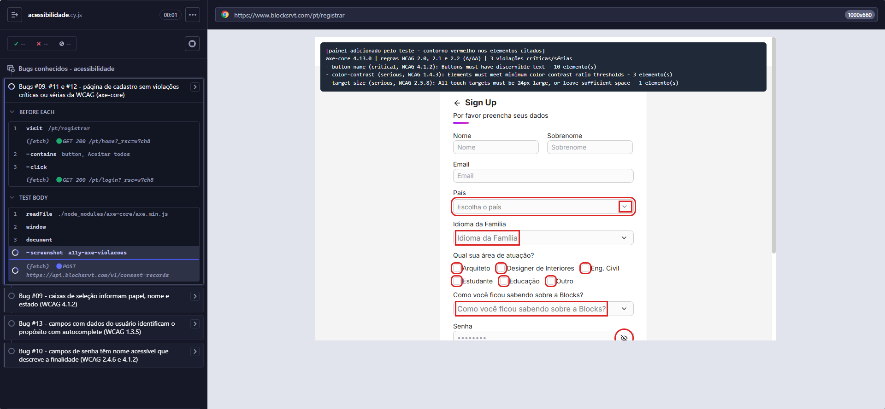

### Bug #09 - Controles Sem Nome, Papel e Estado Acessíveis

| Campo | Detalhes |
|-------|----------|
| **Descrição** | 10 controles do formulário são botões sem nome acessível (regra `button-name` do axe-core, impacto **crítico**). As caixas de seleção (6 áreas de atuação e o aceite da política) são botões sem papel de caixa de seleção e sem estado de marcada/desmarcada |
| **Ambiente** | `/pt/registrar` |
| **Localização** | Caixas de seleção das áreas de atuação e do aceite da política, os 2 botões de mostrar/ocultar senha e a seta do campo de país |
| **Comportamento Atual** | O leitor de tela anuncia apenas "botão", sem dizer qual é nem se está marcado. Mesmo com "Estudante" marcada na tela, o estado não é informado (`papel=button`, `nome=(vazio)`, `marcado=(não informado)`) |
| **Comportamento Esperado** | Caixas de seleção com papel `checkbox` (elemento nativo ou `role="checkbox"`), estado `aria-checked` e nome associado ao texto ao lado; botões de ícone com `aria-label` (ex: "Mostrar senha") |
| **Critério WCAG 2.2** | **4.1.2 Nome, Função, Valor (Nível A)** |
| **Severidade** | **Alta** |
| **Impacto** | Uma pessoa cega que usa leitor de tela não consegue saber quais áreas marcou nem confirmar que aceitou a política de privacidade e os termos de uso, que é obrigatório para concluir o cadastro |
| **Status** | Identificado em 27/09/2026 |
| **Evidência** | [evidencias/acessibilidade/a11y-caixas-de-selecao.png](evidencias/acessibilidade/a11y-caixas-de-selecao.png) e [evidencias/acessibilidade/a11y-axe-violacoes.png](evidencias/acessibilidade/a11y-axe-violacoes.png) |

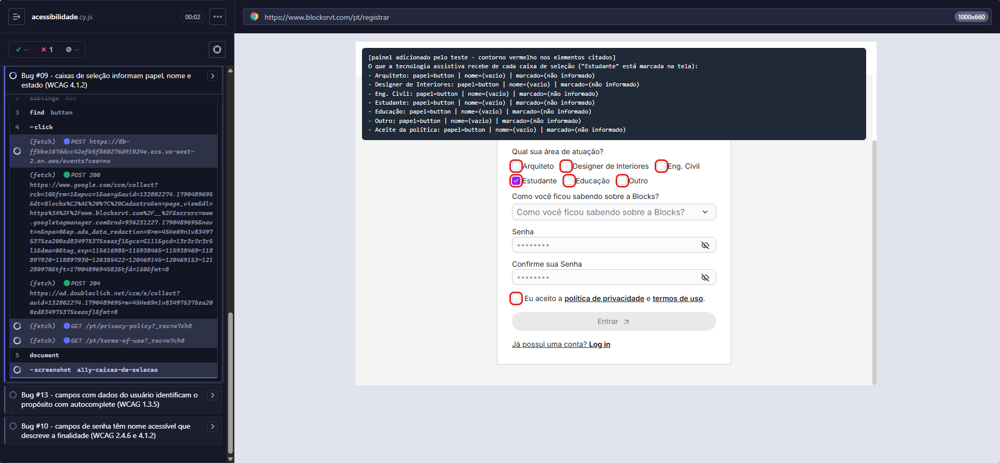

### Bug #10 - Campos de Senha Anunciados como "••••••••"

| Campo | Detalhes |
|-------|----------|
| **Descrição** | Os campos "Senha" e "Confirme sua Senha" não têm rótulo associado; o nome acessível vem do placeholder, que é "••••••••" |
| **Ambiente** | `/pt/registrar` |
| **Localização** | Campos `#password` e `#confirm_password` |
| **Comportamento Atual** | O leitor de tela anuncia os dois campos com o nome "••••••••", sem indicar que são de senha nem qual deles é a confirmação |
| **Comportamento Esperado** | Os rótulos visíveis "Senha" e "Confirme sua Senha" associados aos campos (`<label for>` ou `aria-labelledby`) |
| **Critério WCAG 2.2** | **2.4.6 Cabeçalhos e Rótulos (Nível AA)** e **4.1.2 Nome, Função, Valor (Nível A)** |
| **Severidade** | Média |
| **Impacto** | Usuários de leitor de tela não identificam os campos de senha e podem preencher a confirmação no lugar errado |
| **Status** | Identificado em 27/09/2026 |
| **Evidência** | [evidencias/acessibilidade/a11y-campos-de-senha.png](evidencias/acessibilidade/a11y-campos-de-senha.png) |

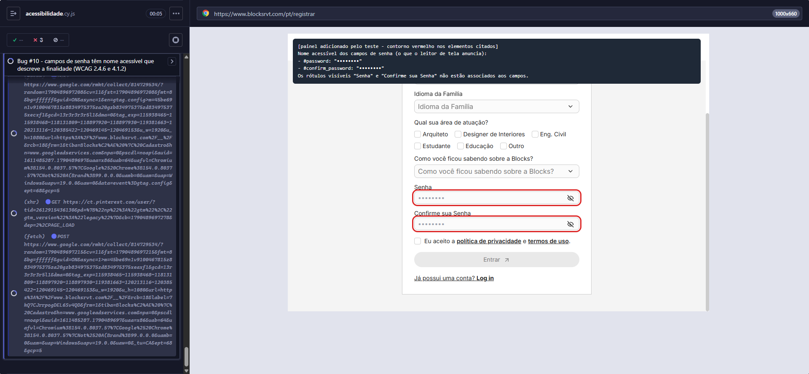

### Bug #11 - Contraste Insuficiente em Textos do Formulário

| Campo | Detalhes |
|-------|----------|
| **Descrição** | 3 textos do formulário têm contraste abaixo do mínimo (regra `color-contrast` do axe-core, impacto sério) |
| **Ambiente** | `/pt/registrar` |
| **Localização** | Placeholder do campo de país e textos exibidos nos campos "Idioma da Família" e "Como você ficou sabendo sobre a Blocks?" |
| **Comportamento Atual** | Texto cinza claro sobre fundo claro, abaixo da relação de contraste de 4.5:1 |
| **Comportamento Esperado** | Relação de contraste de, no mínimo, 4.5:1 para texto normal |
| **Critério WCAG 2.2** | **1.4.3 Contraste (Mínimo) (Nível AA)** |
| **Severidade** | Baixa |
| **Impacto** | Dificuldade de leitura para pessoas com baixa visão e em telas com muito brilho |
| **Status** | Identificado em 27/09/2026 |
| **Evidência** | [evidencias/acessibilidade/a11y-axe-violacoes.png](evidencias/acessibilidade/a11y-axe-violacoes.png) |

### Bug #12 - Área de Toque Pequena na Seta do Campo de País

| Campo | Detalhes |
|-------|----------|
| **Descrição** | O botão de seta do campo de país tem área de toque menor que 24 x 24 pixels, sem espaçamento suficiente (regra `target-size` do axe-core, impacto sério) |
| **Ambiente** | `/pt/registrar` |
| **Localização** | Seta do campo "País" |
| **Comportamento Atual** | Alvo de toque abaixo de 24 x 24 pixels CSS |
| **Comportamento Esperado** | Alvo de pelo menos 24 x 24 pixels CSS ou espaçamento que atenda à exceção do critério |
| **Critério WCAG 2.2** | **2.5.8 Tamanho do Alvo (Mínimo) (Nível AA)** |
| **Severidade** | Baixa |
| **Impacto** | Dificuldade de acionar a seta em telas de toque, principalmente para pessoas com limitação motora |
| **Status** | Identificado em 27/09/2026 |
| **Evidência** | [evidencias/acessibilidade/a11y-axe-violacoes.png](evidencias/acessibilidade/a11y-axe-violacoes.png) |

### Bug #13 - Campos Sem Identificação de Propósito (autocomplete)

| Campo | Detalhes |
|-------|----------|
| **Descrição** | Os campos que coletam dados do próprio usuário não identificam seu propósito com o atributo `autocomplete`; o campo de país tem `autocomplete="off"`, que desliga o preenchimento automático |
| **Ambiente** | `/pt/registrar` |
| **Localização** | Nome, Sobrenome, Email, País, Senha e Confirme sua Senha |
| **Comportamento Atual** | Atributo ausente em 5 campos e `off` no país; o email é `type="text"` |
| **Comportamento Esperado** | `given-name`, `family-name`, `email`, `country-name` e `new-password` (nos dois campos de senha), valores listados na seção 7 "Finalidades de Entrada" da WCAG 2.2; email com `type="email"` |
| **Critério WCAG 2.2** | **1.3.5 Identificar o Propósito de Entrada (Nível AA)** |
| **Severidade** | Baixa |
| **Impacto** | O navegador e os gerenciadores de senha não preenchem os dados automaticamente, o que dificulta o cadastro principalmente para pessoas com limitações motoras ou cognitivas; o gerenciador de senhas também não sugere senha forte para o cadastro |
| **Status** | Identificado em 27/09/2026 |
| **Evidência** | [evidencias/acessibilidade/a11y-autocomplete.png](evidencias/acessibilidade/a11y-autocomplete.png) |

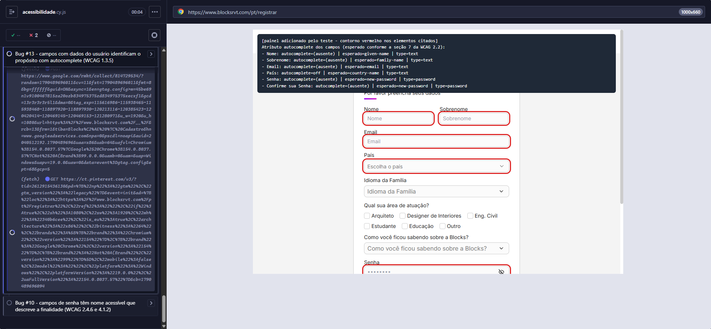

#### Embasamento legal e normativo - Acessibilidade

| Fonte | Texto | Relação com os achados |
|-------|-------|------------------------|
| **Lei nº 13.146/2015 (Lei Brasileira de Inclusão), Art. 63** | "É obrigatória a acessibilidade nos sítios da internet mantidos por empresas com sede ou representação comercial no País ou por órgãos de governo, para uso da pessoa com deficiência, garantindo-lhe acesso às informações disponíveis, conforme as melhores práticas e diretrizes de acessibilidade adotadas internacionalmente." | A diretriz de acessibilidade adotada internacionalmente é a WCAG, do W3C, usada como referência nos Bugs #09 a #13 |
| **WCAG 2.2 - 4.1.2 Nome, Função, Valor (Nível A)** | "Para todos os componentes de interface de usuário (incluindo, mas não se limitando a: elementos de formulário, links e componentes gerados por scripts), o nome e a função podem ser determinados programaticamente; os estados, as propriedades e os valores, que possam ser definidos pelo usuário, podem ser definidos programaticamente [...]" | Bugs #09 e #10 |
| **WCAG 2.2 - 2.4.6 Cabeçalhos e Rótulos (Nível AA)** | "Os cabeçalhos e os rótulos descrevem o tópico ou a finalidade." | Bug #10 |
| **WCAG 2.2 - 1.4.3 Contraste (Mínimo) (Nível AA)** | "A apresentação visual de texto e imagens de texto tem uma relação de contraste de, no mínimo, 4.5:1 [...]" | Bug #11 |
| **WCAG 2.2 - 2.5.8 Tamanho do Alvo (Mínimo) (Nível AA)** | "O tamanho do alvo para entradas de ponteiro é pelo menos 24 por 24 pixels CSS, exceto quando: [...]" | Bug #12 |
| **WCAG 2.2 - 1.3.5 Identificar o Propósito de Entrada (Nível AA)** | "A finalidade de cada campo de entrada que coleta informações sobre o usuário pode ser determinada programaticamente quando: [...] O campo de entrada atende à finalidade identificada na seção Finalidades de Entrada para Componentes de Interface de Usuário [...]" | Bug #13 (a seção 7 lista `given-name`, `family-name`, `email`, `country-name` e `new-password`) |
| **WCAG 2.2 - 1.4.10 Realinhar (Nível AA)** | "O conteúdo pode ser apresentado sem perda de informação ou funcionalidade e sem exigir rolagem em duas dimensões para: Conteúdo de rolagem vertical com largura equivalente a 320 pixels CSS [...]" | Atendido (CT-13) |
| **WCAG 2.2 - 2.1.1 Teclado (Nível A)** | "Toda a funcionalidade do conteúdo é operável através de uma interface de teclado [...]" | Atendido (CT-11) |

Fontes oficiais: [https://www.planalto.gov.br/ccivil_03/_ato2015-2018/2015/lei/l13146.htm](https://www.planalto.gov.br/ccivil_03/_ato2015-2018/2015/lei/l13146.htm) e [https://www.w3.org/Translations/WCAG22-pt-BR/](https://www.w3.org/Translations/WCAG22-pt-BR/) (tradução autorizada da WCAG 2.2 para português do Brasil, publicada pelo W3C em 27/03/2025; a versão normativa em inglês está em [https://www.w3.org/TR/WCAG22/](https://www.w3.org/TR/WCAG22/)).

**Prints das fontes (capturados em 27/09/2026, com o link de origem no topo de cada imagem):**

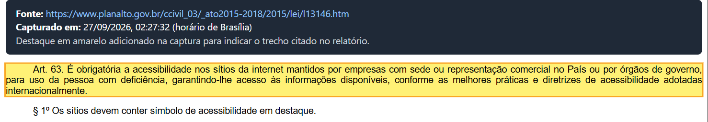

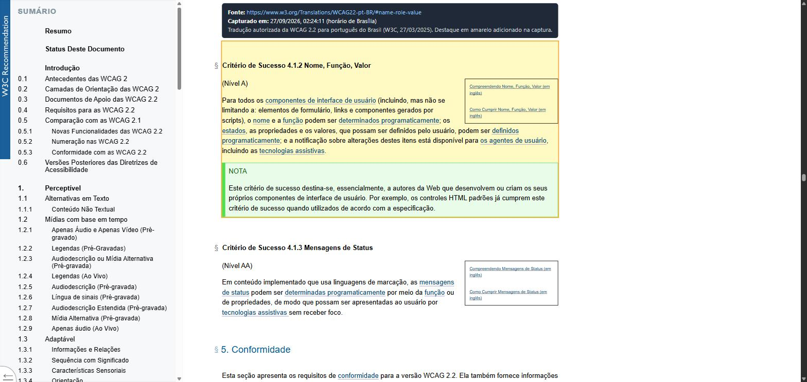

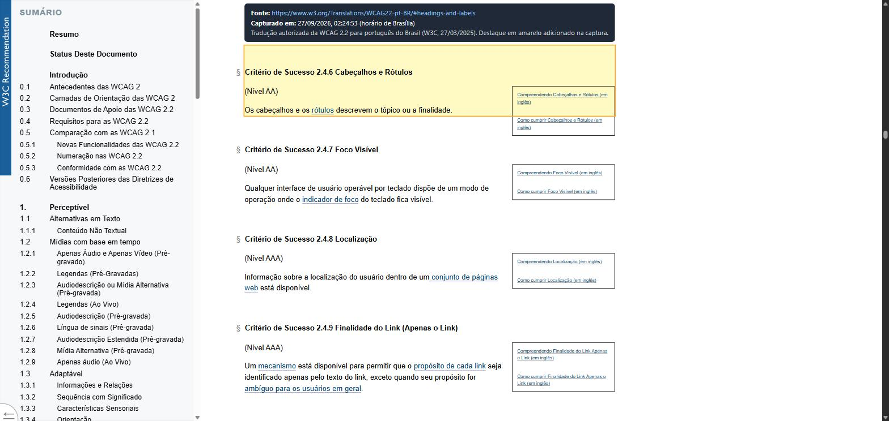

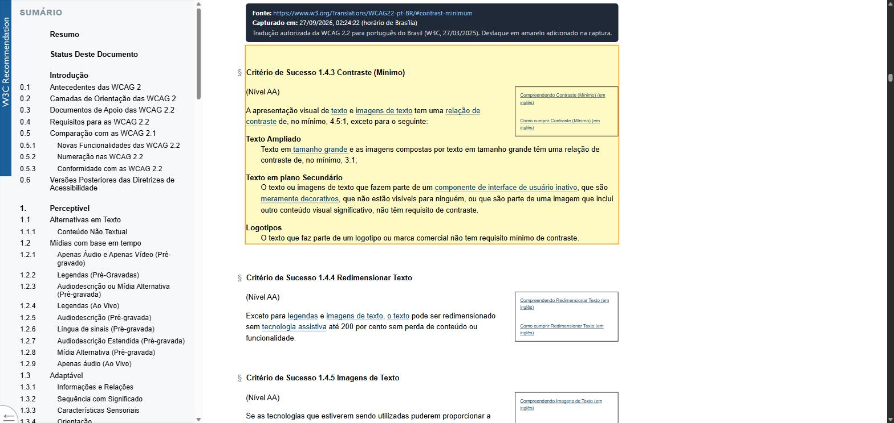

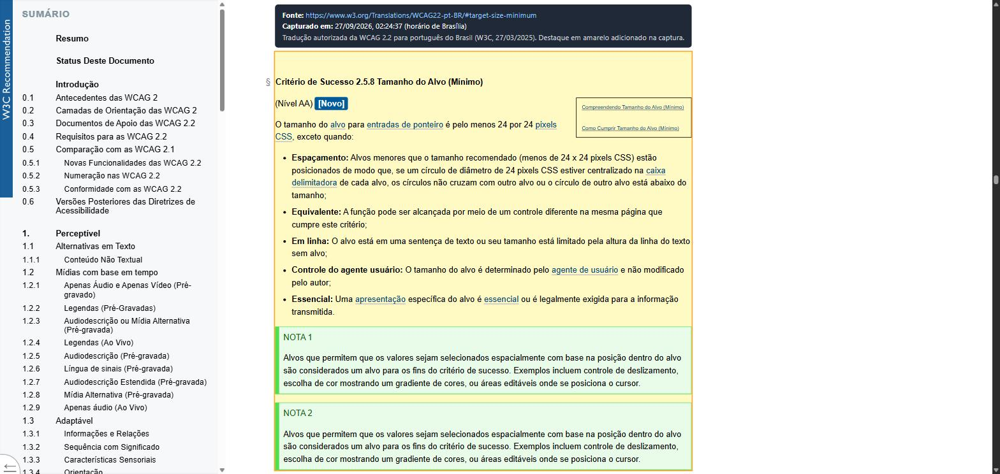

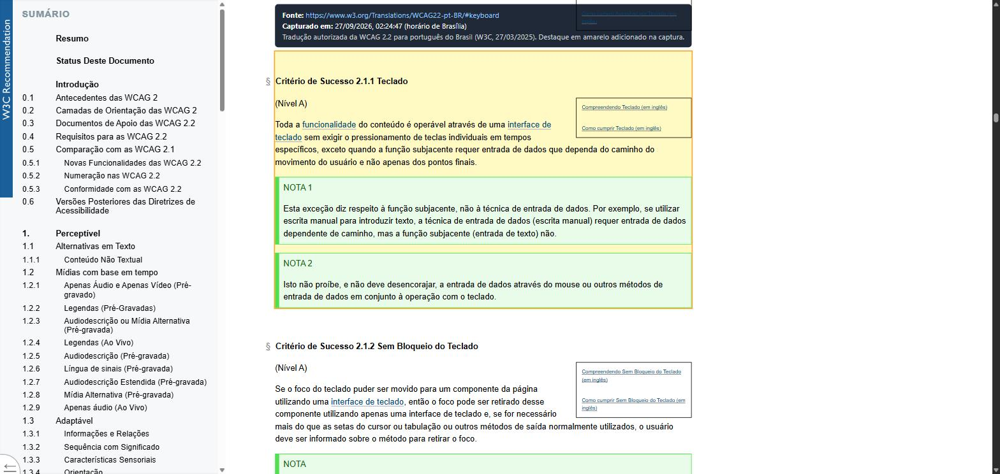

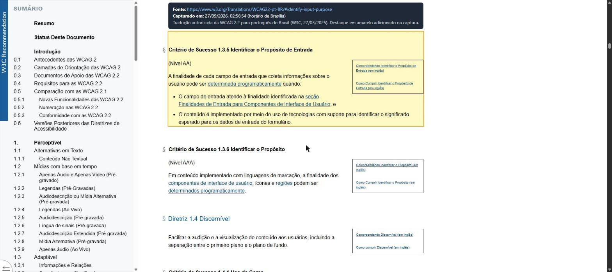

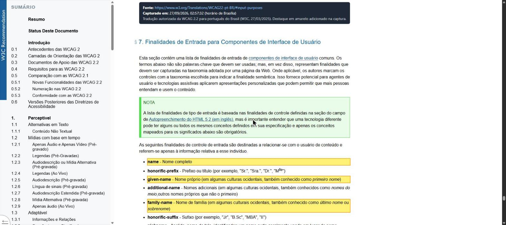

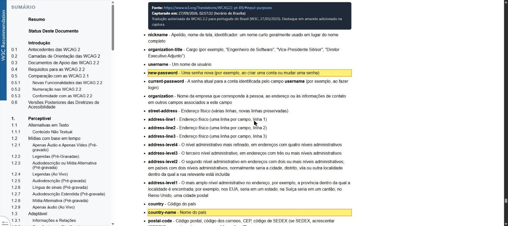

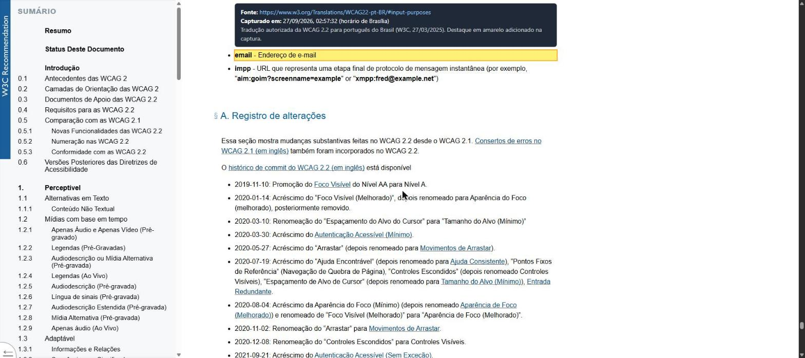

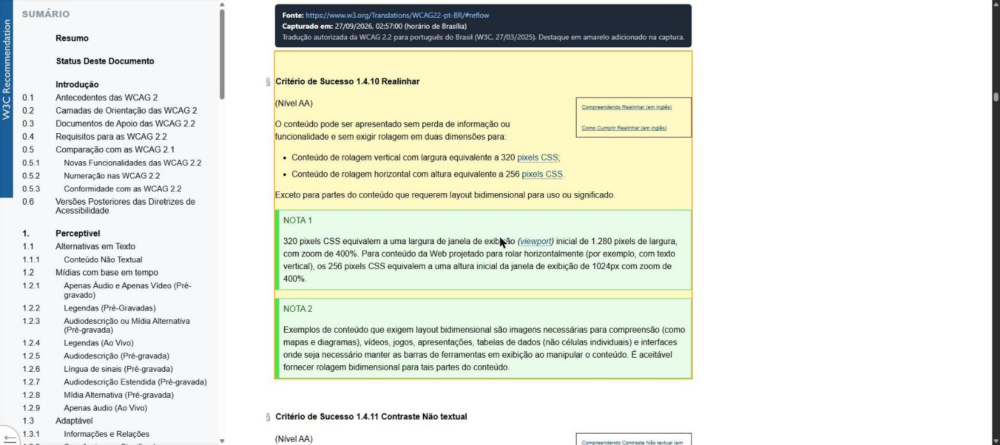

> **Observação:** a caracterização de conformidade legal cabe à assessoria jurídica da Blocks; este relatório aponta os critérios técnicos da WCAG não atendidos, com base na referência indicada pela própria lei.

> **Observação (sem evidência capturada, não classificada como bug):** na página em espanhol, as opções "Other" e "ChatGPT / Gemini / Other AI" do campo "¿Cómo te enteraste de Blocks?" aparecem em inglês.

---

## 7. Análise Crítica de Qualidade

### Pontos Positivos:

- Fluxo de cadastro funciona corretamente do ponto de vista funcional
- Validações de campos estão implementadas
- Feedback visual adequado (botão desabilitado, mensagens de erro)
- Redirecionamento após cadastro bem-sucedido funciona conforme esperado

### Pontos de Atenção:

- **Exposição de dados pessoais pela API de verificação de email, sem autenticação (Bug #05, severidade alta, com implicações na LGPD)**
- Inconsistências de internacionalização nas mensagens de validação, títulos, botões e link da política, nas páginas em português e espanhol (confirmadas pelo teste automatizado de idiomas)
- Aviso de erro exibido no primeiro login de contas novas, mesmo com o login funcionando (Bug #07)
- Cadastro com senha acima de 256 caracteres redireciona como sucesso sem criar a conta (Bug #08)
- Validações que bloqueiam o botão sem explicar o motivo (aceite da política, nome só com espaços)
- **Acessibilidade (Bugs #09 a #13):** controles sem nome, papel e estado para tecnologias assistivas (incluindo o aceite obrigatório da política), campos de senha anunciados como "••••••••", contraste insuficiente, área de toque pequena e campos sem `autocomplete`, com base na WCAG 2.2 e no Art. 63 da Lei Brasileira de Inclusão
- Textos de login na tela de cadastro nos três idiomas ("Entrar", "Iniciar", "Sign in" e o título "Iniciar Sesión")
- Impacto na percepção de qualidade do produto
- Possível confusão para usuários não familiarizados com inglês

### Observações Técnicas:

Os testes automatizados foram implementados de forma a validar o comportamento atual da aplicação, evitando falhas artificiais causadas por textos fixos. Isso garante que os testes reflitam a realidade do sistema e não quebrem desnecessariamente.

---

## 8. Recomendações

### Prioridade Imediata (Bug #05):

- **Restringir a resposta da API de verificação de email** a um indicador de disponibilidade (ex: `{ "available": false }`), sem dados do titular
- **Aplicar limite de requisições** (rate limiting) na rota para dificultar a enumeração de contas
- **Envolver o encarregado de dados (DPO)** para avaliar o impacto e as obrigações previstas na LGPD

### Acessibilidade (Bugs #09 a #13):

- **Usar controles nativos** (`<input type="checkbox">`) ou `role="checkbox"` com `aria-checked` nas áreas de atuação e no aceite da política
- **Associar os rótulos visíveis aos campos** (`<label for>`) e dar `aria-label` aos botões de ícone (mostrar senha, seta do país)
- **Ajustar o contraste** dos textos do formulário e a **área de toque** da seta do país
- **Adicionar `autocomplete`** aos campos (`given-name`, `family-name`, `email`, `country-name`, `new-password`) e usar `type="email"` no email
- **Incluir a varredura automatizada de acessibilidade** (axe-core) no pipeline de CI, como feito neste projeto

### Curto Prazo:

1. **Padronizar mensagens de validação** conforme o idioma selecionado na página
2. **Revisar todas as mensagens do formulário** para garantir consistência de idioma
3. **Implementar testes de regressão** para validações de idioma (ponto de partida já disponível neste projeto: `npm run test:idiomas`)

### Médio Prazo:

4. **Incluir critérios de aceite relacionados a idioma** nos requisitos de funcionalidade
5. **Criar checklist de internacionalização** para novas features
6. **Documentar padrões de mensagens** por idioma suportado

### Longo Prazo:

7. **Implementar testes de internacionalização automatizados** no pipeline CI/CD
8. **Criar biblioteca centralizada de mensagens** por idioma
9. **Realizar auditoria completa de internacionalização** em toda a aplicação

---

## 9. Considerações Finais

O fluxo principal de cadastro encontra-se funcional e estável, atendendo aos requisitos funcionais esperados. Todos os cenários de teste foram executados com sucesso, demonstrando a robustez do sistema.

Os bugs #01 a #04 e #06 (severidade baixa) e os bugs #07, #08 e #10 a #13 (severidade média e baixa: aviso de erro no primeiro login, cadastro com senha acima de 256 caracteres que falha em silêncio e problemas de acessibilidade) não impedem o uso da funcionalidade no fluxo principal, mas impactam a experiência do usuário. O Bug #09 é de severidade alta: impede que uma pessoa que usa leitor de tela confirme o aceite obrigatório da política, contrariando o critério 4.1.2 da WCAG 2.2, referência do Art. 63 da Lei Brasileira de Inclusão. O Bug #05 também é de severidade alta: não afeta o funcionamento do cadastro, mas expõe dados pessoais dos usuários sem autenticação, em desacordo com os princípios de necessidade, segurança e prevenção e com o Art. 46 da LGPD, e deve ser priorizado.

Os testes automatizados implementados cumprem o objetivo proposto no desafio e evidenciam boas práticas de automação e análise de qualidade, incluindo:

- Padrão AAA (Arrange, Act, Assert)
- Data-Driven Testing
- Geração dinâmica de dados
- Evidências visuais (screenshots)
- Relatórios detalhados

De forma geral, a aplicação demonstra estabilidade funcional no fluxo de cadastro, com oportunidades de melhoria em aspectos de experiência de usuário e internacionalização, que poderia elevar ainda mais a percepção de qualidade do produto, e um ponto prioritário de segurança e privacidade de dados (Bug #05) a ser tratado com base na LGPD.

---

## Apêndice - Evidências Visuais (Screenshots)

### CT-01 - Cadastro com sucesso


**Descrição:** Prova visual do redirecionamento para página de login após cadastro bem-sucedido

### CT-02 - Cadastro com email inválido


**Descrição:** Prova visual do alerta de email inválido

### CT-03 - Cadastro com email já em uso


**Descrição:** Prova visual do alerta de email já em uso

### CT-04 - Cadastro sem aceitar política de privacidade


**Descrição:** Prova visual da tentativa de cadastro sem aceitar a política de privacidade

### CT-05 - Cadastro com senhas diferentes


**Descrição:** Prova visual da tentativa de cadastro com senhas diferentes

### Testes de Idioma - Título, Botão e Link da Política


**Descrição (`/pt`):** título "Sign Up" em inglês (Bug #03) e botão "Entrar" (Bug #04)


**Descrição (`/es`):** título "Iniciar Sesión" e botão "Iniciar", textos de login (Bug #04); link "política de privacidade" em português (Bug #06)


**Descrição (`/en`, controle):** título "Sign Up" correto; botão "Sign in", texto de login (Bug #04)

--- 

**Relatório gerado por:** Cristhian Cintra Barbosa  
**Ferramenta de automação:** Cypress v15.9.0  
**Data:** 22/01/2026 (atualizado em 26/09/2026)
